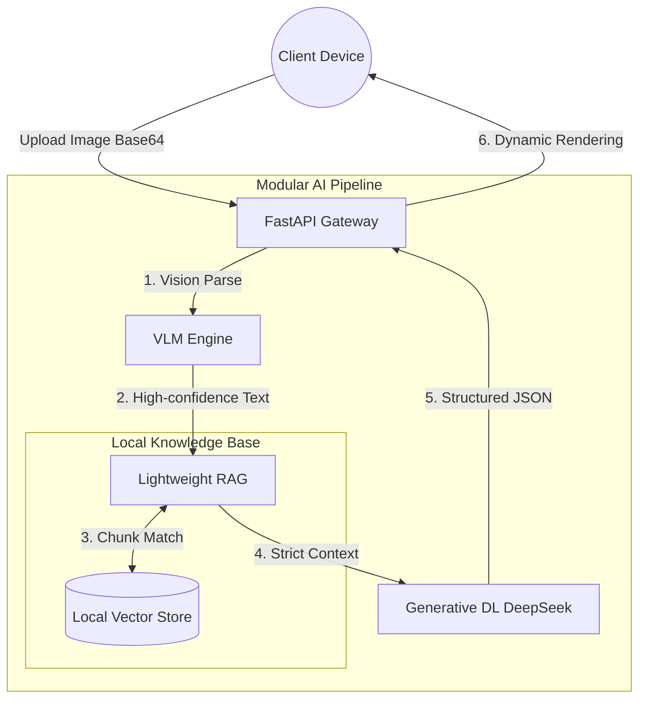

<div align="center">
  <!--  -->

  <h1>🛡️ MiniRaguard</h1>

  <p>
    <strong>A Plug-and-Play Multimodal RAG Guardrail Framework</strong><br>
    <em>让任何人用 10 分钟，从零构建企业级文档智能风控系统。</em>
  </p>

  <p>
    <a href="https://github.com/KardeniaPoyu/Qingju/stargazers"></a>
    <a href="https://github.com/KardeniaPoyu/Qingju/network/members"></a>
    <a href="https://github.com/KardeniaPoyu/Qingju/issues"></a>
    <a href="https://opensource.org/licenses/MIT"></a>
  </p>

  <p>
    
    
    
    
  </p>

[**English**](./README_EN.md) | [**简体中文**](./README.md)

</div>

<br/>

## 📖 Table of Contents

- [✨ What is MiniRaguard?](#-what-is-miniraguard)
- [🚀 Live Demo](#-live-demo)
- [🔥 Key Features](#-key-features)
- [🏗️ Architecture](#️-architecture)
- [🚀 Quick Start](#-quick-start)
- [🛠️ Build Your Own App](#️-build-your-own-app)
- [📈 Star History](#-star-history)
- [🤝 Contributing & License](#-contributing--license)

---

## ✨ What is MiniRaguard?

在各类垂直领域（医疗审核、财务报表、信访维权、合同法务），我们经常面临三大阻碍：**图片数据模糊**、**大模型幻觉频发**、**高并发难以承载**。

**MiniRaguard** 提供了一个**极轻量、开箱即用**的开源全栈解决方案（后端分析引擎 + 跨端小程序）。它创新性地结合了 **VLM (大视觉模型)** 和 **RAG (检索增强生成)**，强制 AI 基于你的本地知识库进行事实推理。

无论你是想搭建一个“医疗单据智审助手”，还是“社区民情研判总机”，只需**扔进你的 TXT 库，修改一段 Prompt**，即可立刻上线。

---

## 🚀 Live Demo

以自带的 **“单据/合同合规风控助手”** 实例为演示：

https://github.com/KardeniaPoyu/Qingju/raw/main/demo.mp4

<br/>

## 🔥 Key Features

- **基于端云协同的深度视觉提取 (Vision LLM)**
  系统原生接入深度视觉模型（Qwen-VL），能够直接规避传统 OCR 排版解析错误、手写难以识别的工程瓶颈，适用于褶皱票据、逆光照片、混合排版等复杂信息录入场景。
- **事实基准检索生成架构 (Fact-based RAG)**
  针对严肃法务、财务、政务场景，模型通过高并发检索比对本地向量数据库内的垂直领域规范，严格约束大模型推理过程，有效杜绝常识性“幻觉”以及法规引用的张冠李戴。
- **高并发与内存安全自适应机制 (Adaptive Concurrency)**
  - **MD5 状态热缓存**：对于已验证过的重复文件实施缓存阻截，极大程度缩减大模型 Token 成本并实现秒级响应。
  - **动态信号量阻塞锁**：在应用层实现并发强关联控制，能够有效抵御突发推理请求引起的服务崩溃，单节点即可承载数百用户。
- **开箱即用的跨端服务架构 (Full-Stack Support)**
  框架内置完善的 Vue/UniApp 跨平台独立组件（支持 Web 及微信客户端环境），从接口到视图均开箱即用，避免开发者陷入前后端联调的冗余工作。

---

## 🏗️ Architecture

秉承高内聚、低耦合的优雅设计理念，业务流如丝般顺滑：



---

## 🚀 Quick Start

构建你的 AI 应用？只需十分钟！

### 1. 部署高可用后端 (Backend)

```bash
# 1. 克隆代码仓库
git clone https://github.com/KardeniaPoyu/Qingju.git
cd Qingju/backend

# 2. 安装 Python 依赖 
pip install -r requirements.txt

# 3. 环境变量配置 (填入你的 API KEY)
cp .env.example .env

# 4. 一键起飞！
python main.py
```
> 👉 访问 `http://localhost:8000/docs` 查看交互式 API 文档。

### 2. 部署跨端客户端 (Frontend)

1. 下载 [HBuilderX](https://www.dcloud.io/hbuilderx.html) IDE。
2. 将 `frontend` 目录导入。
3. 修改 `config.js` 中的 `BASE_URL` 为你刚刚部署的后端服务地址。
4. 一键运行至内置浏览器或微信开发者工具！

---

## 🛠️ Build Your Own App
把这套框架变成你的专属利器！黄金三步走：

1. **注入私有知识**：清空 `backend/data/` 目录，扔进符合你业务场景的 TXT 或 Markdown 手册。
2. **清理缓存重塑**：删除 `backend/cache.db` 和 `vector_store/` 目录，系统下次启动将自动“消化”新知识。
3. **注入灵魂 Prompt**：打开 `backend/core/chat_tool.py`，更改顶栏的 System Prompt 定位。（比如从“风控顾问”改成“三甲医院财务报销审核员”）。

---

## 📈 Star History

[](https://star-history.com/#KardeniaPoyu/Qingju&Date)

---

## 🤝 Contributing & License

**“开源改变世界，AI 赋能万物。”**

无论你是修补了一个拼写错误，还是在你的业务中用 MiniRaguard 做出了惊艳的落地应用，我们都期待你的 Pull Request！详见 [CONTRIBUTING.md](CONTRIBUTING.md)。

本项目采用 **[MIT](LICENSE)** 开源协议。如果你觉得这个项目对你有帮助，不妨点一个 ⭐ **Star** 鼓励一下作者！

<div align="center">
  <i>Made with ❤️ by the MiniRaguard Team</i>
</div>
