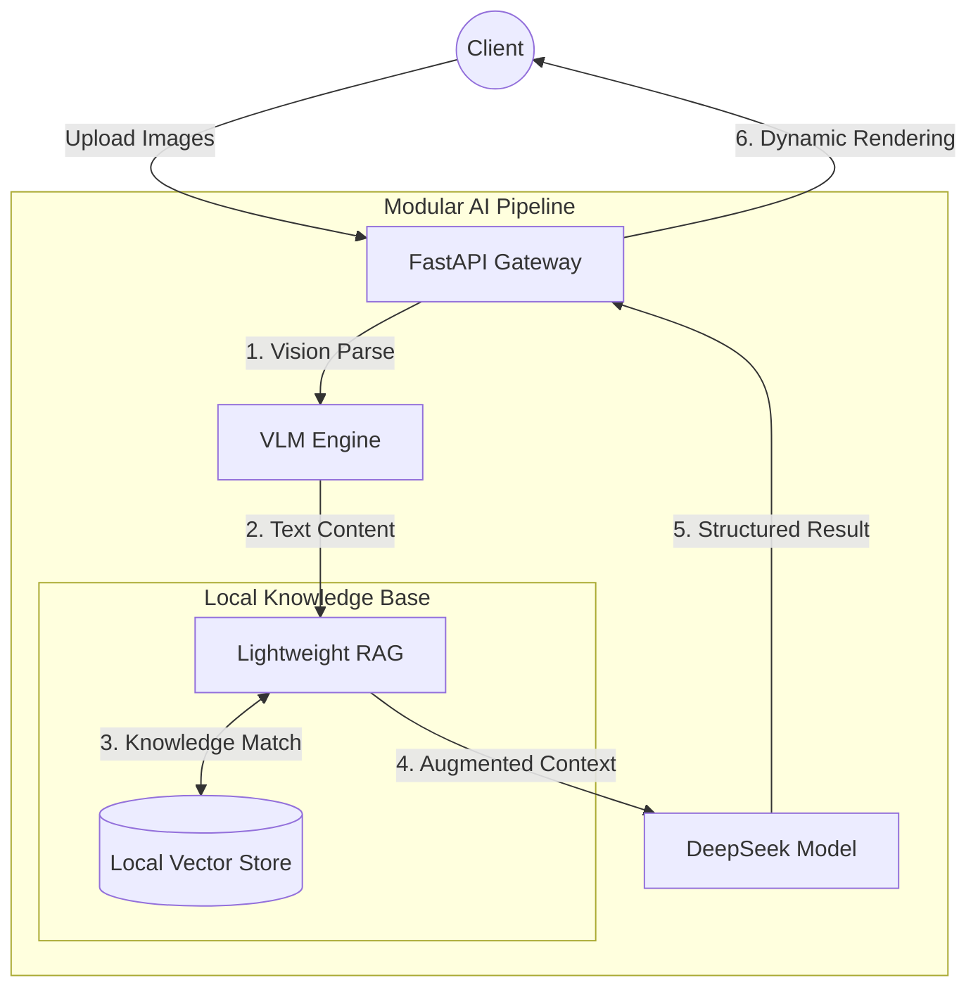

<div align="center">
  <!--  -->

  <h1>🛡️ MiniRAGuard</h1>

  <p>
    <strong>A Lightweight Full-stack RAG Audit Agent Template</strong><br>
    <em>Build your own vertical multimodal AI RAG audit assistant in just 10 minutes.</em>
  </p>

  <p>
    <a href="https://github.com/KardeniaPoyu/MiniRAGuard/stargazers"></a>
    <a href="https://github.com/KardeniaPoyu/MiniRAGuard/network/members"></a>
    <a href="https://github.com/KardeniaPoyu/MiniRAGuard/issues"></a>
    <a href="https://opensource.org/licenses/MIT"></a>
  </p>

  <p>
    
    
    
    
  </p>

[**English**](./README.md) | [**简体中文**](./README_zh.md) | [**日本語**](./README_ja.md)

</div>

<br/>

## 📖 Table of Contents

- [✨ What is MiniRAGuard?](#-what-is-miniraguard)
- [🏗️ Directory Structure](#-directory-structure)
- [🚀 Quick Start](#-quick-start)
- [🔥 Core Highlights](#-core-highlights)
- [🏗️ Architecture](#-architecture)
- [🛠️ Build Your Own AI Agent](#-build-your-own-ai-agent)
- [🤝 Contributing & License](#-contributing--license)

---

## ✨ What is MiniRAGuard?

In **vertical audit fields** such as medical auditing, financial reporting, and petition review, developers often face three major pain points: **unstructured/blurry image data**, **frequent LLM hallucinations**, and **difficulty handling high-concurrency requests**.

Addressing these three points, **MiniRAGuard** provides a **lightweight, out-of-the-box** full-stack RAG business template. By combining **VLM (Vision Large Models)** with **RAG (Retrieval-Augmented Generation)**, it forces the AI to reason strictly based on your local knowledge base, helping developers quickly integrate document retrieval and output constraint mechanisms into vertical applications.

**MiniRAGuard** aims to provide engineering certainty and boundary control for complex document review processes powered by LLMs. It includes not only a minimalist RAG implementation but also a complete business showcase UI. Simply **drop your TXT files into the library and modify a single Prompt** to launch your specialized assistant. Launch and deploy a WeChat mini-program or website in just ten minutes—perfect for beginners to learn the RAG architecture.

---

## 🚀 Business Instance Demo

Demonstrating with the built-in **"Receipt/Contract Compliance Risk Assistant"** instance located in `examples/rent_assistant`:

https://github.com/user-attachments/assets/28709a21-b789-4ed4-9fc6-ffad16611da7

<br/>

## 🔥 Core Highlights

- **Fact-based RAG Search & Generation**  
  Specifically for legal, financial, and other serious scenarios, the system uses Sentence-Transformers to build a local vector database (VectorDB). The LLM retrieves relevant regulations from the local database before reasoning, significantly reducing "hallucinations" and providing concrete sources for judgments.
- **Out-of-the-box Multimodal Document Access**  
  Integrated mainstream VLM interface call logic (default Qwen-VL API), supporting direct upload of contract scans, images, or PDFs to quickly extract key information. Developers can process documents without writing complex multimodal parsing code.
- **Lightweight Compliance Review Workflow**  
  Built-in basic "review-feedback" Prompt template design, effectively constraining output boundaries for sensitive texts (like leases or boilerplate clauses). Ideal for business-side PoCs (Proof of Concept).
- **Full-stack Scaffold with Separated Frontend/Backend**  
  Provides complete production-grade source code for `backend` (FastAPI) and `frontend` (Vue/UniApp). Developers can learn RAG implementation while having a ready-to-use UI for demonstrations.
- **Concurrency & Cache Control**
  - **MD5 Caching Mechanism**: Intercepts repeated verifications by calculating file MD5, reducing unnecessary API Token consumption and latency.
  - **Semaphore Flow Control**: Backend thread flow control ensures stable service operation during traffic spikes by limiting concurrent requests to the LLM.

---

## 🏗️ Directory Structure (Structure)

```text
.
├── miniraguard/          # Abstract Core Framework
├── examples/
│   └── rent_assistant/   # Official "Rental Assistant" Demo
│       ├── backend/      # Business logic implementation
│       ├── frontend/     # UniApp mobile source code
│       └── data/         # Business knowledge base & vector DB storage
├── docs/                 # Documentation
└── tests/                # Unit tests
```

---

## 🚀 Quick Start (Rental Assistant Demo)

### 1. Deploy Backend

```bash
# 1. Clone and enter directory
git clone https://github.com/KardeniaPoyu/MiniRAGuard.git
cd MiniRAGuard/examples/rent_assistant/backend

# 2. Install dependencies and configure environment
pip install -r ../../../requirements.txt 
cp .env.example .env # Add your API KEY

# 3. Launch!
python main.py
```

### 2. Deploy Frontend

1. Download and install [HBuilderX](https://www.dcloud.io/hbuilderx.html) IDE.
2. Import the `examples/rent_assistant/frontend` directory.
3. Update `BASE_URL` in `config.js` to your deployed backend address.
4. Run in the built-in browser or WeChat DevTools!

---

## 🏗️ Architecture



---

## 🛠️ Build Your Own AI Agent

1. **Inject Private Knowledge**: Clear `examples/rent_assistant/data/` and add your own TXT or Markdown manuals.
2. **Rebuild Vector Index**: Delete the `vector_store` directory; it will be automatically rebuilt on the next startup.
3. **Adjust Business Logic**: Modify the System Prompt in `examples/rent_assistant/backend/prompts.py`.

---

## 📈 Star History

<a href="https://www.star-history.com/?repos=KardeniaPoyu%2FMiniRAGuard&type=date&legend=top-left">
 <picture>
   <source media="(prefers-color-scheme: dark)" srcset="https://api.star-history.com/chart?repos=KardeniaPoyu/MiniRAGuard&type=date&theme=dark&legend=top-left" />
   <source media="(prefers-color-scheme: light)" srcset="https://api.star-history.com/chart?repos=KardeniaPoyu/MiniRAGuard&type=date&legend=top-left" />
   
 </picture>
</a>

## 🤝 Contributing & License

Whether you fixed a typo or built an amazing application using MiniRAGuard, we look forward to your Pull Request! See [CONTRIBUTING.md](CONTRIBUTING.md) for details.

This project is licensed under the **[MIT](LICENSE)** license. If you find this project helpful, please give it a ⭐ **Star**!
