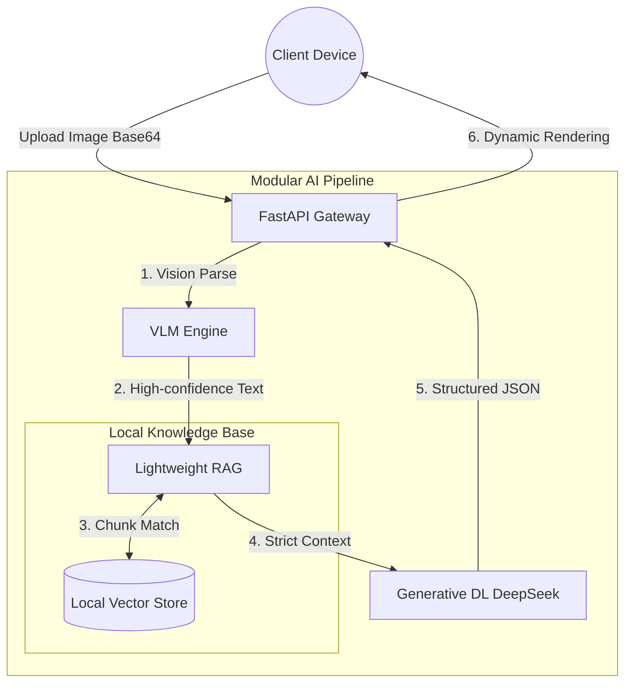

<div align="center">
  <!--  -->

  <h1>🛡️ MiniRAGuard</h1>

  <p>
    <strong>A Plug-and-Play Multimodal RAG Guardrail Framework</strong><br>
    <em>Empowering anyone to build an enterprise-level document AI guardrail system from scratch in 10 minutes.</em>
  </p>

  <p>
    <a href="https://github.com/KardeniaPoyu/MiniRAGuard/stargazers"></a>
    <a href="https://github.com/KardeniaPoyu/MiniRAGuard/network/members"></a>
    <a href="https://github.com/KardeniaPoyu/MiniRAGuard/issues"></a>
    <a href="https://opensource.org/licenses/MIT"></a>
  </p>

  <p>
    
    
    
    
  </p>

[**English**](./README.md) | [**简体中文**](./README_zh.md) | [**日本語**](./README_ja.md)

</div>

<br/>

## 📖 Table of Contents

- [✨ What is MiniRAGuard?](#-what-is-miniraguard)
- [🚀 Live Demo](#-live-demo)
- [🔥 Key Features](#-key-features)
- [🏗️ Architecture](#️-architecture)
- [🚀 Quick Start](#-quick-start)
- [🛠️ Build Your Own App](#️-build-your-own-app)
- [📈 Star History](#-star-history)
- [🤝 Contributing & License](#-contributing--license)

---

## ✨ What is MiniRAGuard?

Across various **vertical audit fields** (such as medical audits, financial reports, legal compliance, or petition reviews), developers often face three major hurdles: **blurry/unstructured image data**, **frequent LLM hallucinations**, and **difficulty handling high-concurrency requests**.

**MiniRAGuard** provides a **lightweight, plug-and-play** open-source full-stack solution (Backend Analytics Engine + Cross-platform Mini Program). It innovatively combines **VLM (Vision Large Models)** with **RAG (Retrieval-Augmented Generation)**, forcing AI to reason strictly based on your local knowledge base.

Whether you want to build a "Medical Receipt Audit Assistant" or a "Community Petition Analytics Terminal," just **drop your TXT files into the library and modify a single Prompt** to go live immediately.

---

## 🚀 Live Demo

Demonstrating with the built-in **"Receipt/Contract Compliance Guardrail"** instance:

<video src="./demo.mp4" width="100%" controls></video>

<br/>

## 🔥 Key Features

- **Vision Extraction via Qwen-VL API (Vision LLM)**  
  The system calls the Qwen-VL API for image information recognition and extraction. Compared to traditional OCR, it can better handle complex typesetting, handwritten text, or poor-quality source documents, improving the accuracy of text conversion from unstructured images.
- **RAG-based Local Knowledge Retrieval (Fact-based RAG)**  
  Designed for legal, financial, and other serious contexts, the system uses Sentence-Transformers to build a local vector database (VectorDB). Before reasoning, the LLM retrieves relevant regulations from the local database, which helps reduce common-sense "hallucinations" and provides concrete sources for its judgments.
- **Concurrency & Cache Control mechanisms (Concurrency & Caching)**  
  - **MD5 Caching Mechanism**: Calculates the file MD5 to intercept repeated document verifications, returning local cache results directly. This reduces unnecessary LLM API tokens and lowers response latency.
  - **Semaphore Concurrency Control**: The backend deploys a semaphore-based flow control mechanism to limit the number of concurrent requests passed to the LLM during traffic spikes, ensuring stable service operation.
- **Separation of Frontend and Backend (Full-Stack Support)**  
  Provides a pure asynchronous server based on FastAPI and cross-platform client code built with Vue/UniApp (supporting Web and WeChat Mini Programs). Developers can use the complete business flow directly after deployment.

---

## 🏗️ Architecture

Adhering to an elegant design philosophy of high cohesion and low coupling, the business flow is silky smooth:



---

## 🚀 Quick Start

Build your AI app? Just 10 minutes!

### 1. Deploy the High-Availability Backend

```bash
# 1. Clone the repository
git clone https://github.com/KardeniaPoyu/MiniRAGuard.git
cd MiniRAGuard/backend

# 2. Install Python dependencies
pip install -r requirements.txt

# 3. Environment configuration (Insert your API KEYs)
cp .env.example .env

# 4. Launch!
python main.py
```
> 👉 Visit `http://localhost:8000/docs` to view the interactive API documentation.

### 2. Deploy the Cross-Platform Client (Frontend)

1. Download the [HBuilderX](https://www.dcloud.io/hbuilderx.html) IDE.
2. Import the `frontend` directory.
3. Modify the `BASE_URL` in `config.js` to point to your newly deployed backend service.
4. Run securely in the built-in browser or WeChat DevTools!

---

## 🛠️ Build Your Own App
Turn this framework into your exclusive vertical tool in 3 golden steps:

1. **Inject Private Knowledge**: Clear the `backend/data/` directory and drop in TXT or Markdown manuals relevant to your business domain.
2. **Rebuild Cache & Vectors**: Delete the `backend/cache.db` and `vector_store/` directories. The system will automatically "digest" the new knowledge on the next startup.
3. **Inject the Soul Prompt**: Open `backend/core/chat_tool.py` and change the System Prompt identity at the top (e.g., from "Risk Control Advisor" to "Tier-3 Hospital Financial Reimbursement Auditor").

---

## 📈 Star History

[](https://star-history.com/#KardeniaPoyu/MiniRAGuard&Date)

---

## 🤝 Contributing & License

**"In praise of the open-source spirit."**

Whether you fixed a typo or built an amazing production app using MiniRAGuard in your domain, we welcome your Pull Requests! See [CONTRIBUTING.md](CONTRIBUTING.md) for details.

This project is licensed under the **[MIT](LICENSE)** open-source license. If you find this project helpful, please give the author a ⭐ **Star** for encouragement!

