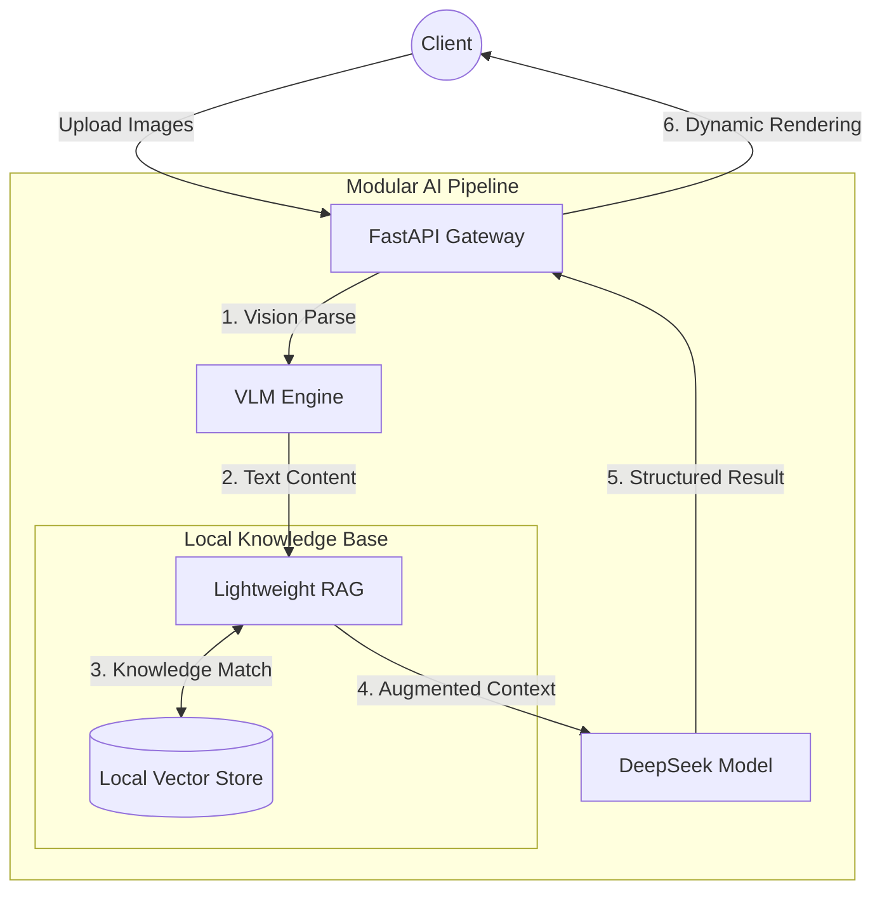

<div align="center">

<h1>MiniRAGuard</h1>

<p>
    <strong>Full-stack Multimodal RAG Template for Auditing and Compliance Review</strong>
</p>

<p>
    <a href="https://github.com/KardeniaPoyu/MiniRAGuard/stargazers"></a>
    <a href="https://github.com/KardeniaPoyu/MiniRAGuard/network/members"></a>
    <a href="https://opensource.org/licenses/MIT"></a>
</p>

<p>
    
    
    
    
</p>

[**English**](./README.md) | [**简体中文**](./README_zh.md) | [**日本語**](./README_ja.md)

</div>

---

## Overview

MiniRAGuard is a full-stack technical template integrating Vision Large Models (VLM) and Retrieval-Augmented Generation (RAG). It provides a standardized implementation for document auditing, compliance review, and automated structured parsing in vertical domains.

## Technical Features

- **Fact-based Retrieval-Augmented Generation**: Utilizes Sentence-Transformers and a local vector database to ensure model reasoning is grounded in predefined regulations, reducing hallucinations.
- **Multimodal Document Parsing**: Integrated VLM support (defaulting to Qwen-VL) for automated structured data extraction from scans, images, and PDFs.
- **Audit Workflow Constraints**: Built-in "review-feedback" Prompt templates to define output boundaries for sensitive business scenarios like legal or financial audits.

## Demo

Video demonstration of the built-in Rental Compliance Assistant:

https://github.com/user-attachments/assets/28709a21-b789-4ed4-9fc6-ffad16611da7

## Engineering Components
  - **Backend**: High-performance asynchronous API built with FastAPI.
  - **Frontend**: Cross-platform business interface built with UniApp/Vue.
- **System Stability & Optimization**:
  - **Request Caching**: MD5-based file verification to intercept redundant requests and reduce API costs.
  - **Concurrency Control**: Semaphore-based flow control to limit concurrent requests to LLM endpoints, ensuring service stability.

## Architecture



## Directory Structure

- `miniraguard/`: Abstract core framework.
- `examples/`: Business implementation examples (e.g., Rental Compliance Assistant).
  - `backend/`: Backend business logic.
  - `frontend/`: Frontend UniApp source code.
  - `data/`: Knowledge base and vector storage.
- `docs/`: Technical documentation.

## Quick Start

### 1. Backend Deployment

```bash
git clone https://github.com/KardeniaPoyu/MiniRAGuard.git
cd MiniRAGuard/examples/rent_assistant/backend
pip install -r ../../../requirements.txt 
cp .env.example .env # Add your API_KEY
python main.py
```

### 2. Frontend Deployment

1. Import `examples/rent_assistant/frontend` into HBuilderX.
2. Update `BASE_URL` in `config.js` to your backend address.
3. Run in the built-in browser or WeChat DevTools.

## Customization

1. **Inject Knowledge**: Replace files in `examples/rent_assistant/data/` with your own TXT or Markdown files.
2. **Reset Index**: Delete the `vector_store` directory; the index will be rebuilt on the next startup.
3. **Adjust Logic**: Modify the System Prompt in `backend/prompts.py`.

## License

This project is licensed under the [MIT](LICENSE) License.
