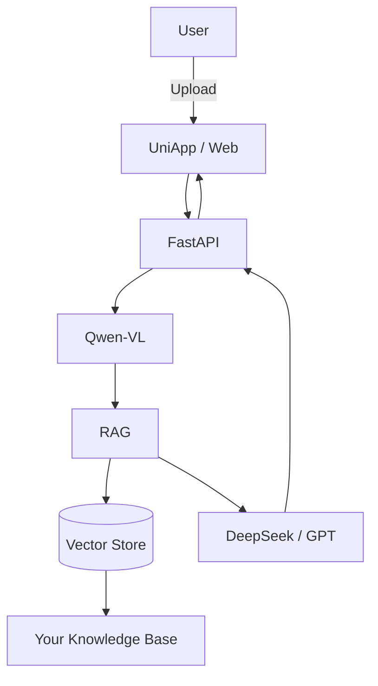

<p align="center">
</p>
<div align="center">
<h1>🛡️ MiniRaguard</h1>

<p>
<strong>The Plug-and-Play Multimodal RAG Guardrail Framework</strong>
</p>

<p>
让任何人用 <b>10 分钟</b> 构建一个<br/>
📄 文档审查 / ⚖️ 合规风控 / 🏥 医疗票据分析 / 🧾 合同助手 的 AI 系统
</p>


  
  
  
  


<p>
<a href="https://github.com/KardeniaPoyu/MiniRaguard/stargazers">

</a>
<a href="https://github.com/KardeniaPoyu/MiniRaguard/fork">

</a>
<a href="https://opensource.org/licenses/MIT">

</a>
</p>

</div>

---

# 🔥 Why MiniRaguard?

当前 LLM 最大的问题不是“不会回答”，而是：

> ❗ 回答不可靠（Hallucination）
> ❗ 无法处理图片 / 扫描件
> ❗ 无法基于真实法规 / 文档推理

👉 MiniRaguard 解决的是一个更底层的问题：

> **如何构建“可信的、多模态、可落地”的 AI 审查系统？**

---

# ✨ What You Get

这是一个 **开箱即用的 AI 全栈模板**：

```
📸 图片 / PDF / 截图
        ↓
👁️ VLM 视觉解析 (Qwen-VL)
        ↓
📚 RAG 知识检索（本地文档）
        ↓
🧠 LLM 推理（DeepSeek / GPT）
        ↓
🛡️ 风险判断 + 可解释输出
```

---

# 🧠 Core Design Philosophy

## 1. Guardrail First（拒绝幻觉）

* 强制 LLM 必须基于 RAG 检索结果回答
* 每个结论都可以追溯来源
* 不再“胡说八道”

---

## 2. Multimodal Native（原生多模态）

* 不再依赖传统 OCR
* 直接使用 VLM（Qwen-VL）理解图像
* 支持：

  * 📸 拍照合同
  * 🧾 发票
  * 📝 手写文本

---

## 3. Pipeline as Product

将 AI 系统抽象为稳定流水线：

```
Upload → Vision → Retrieve → Reason → Render
```

👉 这意味着：

* 任何业务 = 替换知识库 + Prompt
* 不需要重写系统

---

## 4. Production-Ready Backend

不是玩具 demo，而是：

* ⚡ MD5 Cache（避免重复调用 LLM）
* 🔒 并发控制（防止模型接口爆掉）
* 📦 FastAPI 标准服务化

---

# 🎯 Use Cases

只需替换知识库，即可落地：

| 场景       | 示例          |
| -------- | ----------- |
| ⚖️ 法律    | 合同审查 / 法条匹配 |
| 🏥 医疗    | 票据分析 / 报销审核 |
| 🏢 企业    | 内部合规检查      |
| 🏘️ 社会治理 | 投诉/信访分析     |
| 🧾 财务    | 发票异常检测      |

---

# 🎬 Demo

<div align="center">
<video src="https://github.com/KardeniaPoyu/Qingju/raw/main/demo.mp4" width="80%" controls autoplay muted loop></video>
</div>

---

# 🏗️ Architecture



---

# 🚀 Quick Start

## 1️⃣ Backend

```bash
git clone https://github.com/KardeniaPoyu/MiniRaguard.git
cd MiniRaguard/backend

pip install -r requirements.txt

cp .env.example .env
# 填入 API KEY

python main.py
```

👉 打开：http://localhost:8000/docs

---

## 2️⃣ Frontend

* 使用 HBuilderX 打开 `/frontend`
* 修改 API 地址
* 运行即可

---

# ⚡ Build Your Own AI App in 10 Minutes

只需 3 步：

### 1. 替换知识库

```
backend/data/
```

👉 放入：

* 法规
* 合同模板
* 行业手册

---

### 2. 重建向量库

删除：

```
cache.db
vector_store/
```

---

### 3. 修改 Prompt

```python
backend/core/chat_tool.py
```

👉 改成你的角色：

* 法务顾问
* 医疗审核员
* 风控专家

---

# 🧪 Comparison

| 能力   | 传统 OCR + LLM | MiniRaguard |
| ---- | ------------ | ----------- |
| 图片理解 | ❌            | ✅           |
| 幻觉控制 | ❌            | ✅           |
| 可解释性 | ❌            | ✅           |
| 可复用性 | ❌            | ✅           |

---

# 🤝 Contributing

欢迎 PR / Issue！

如果你用这个框架做了项目，欢迎展示：

* 🔥 Case Study
* 📊 Benchmark
* 🧠 新 Prompt

---

# 📄 License

MIT License

---

<div align="center">

<b>Build Trustworthy AI, Not Just Smart AI.</b>

</div>
