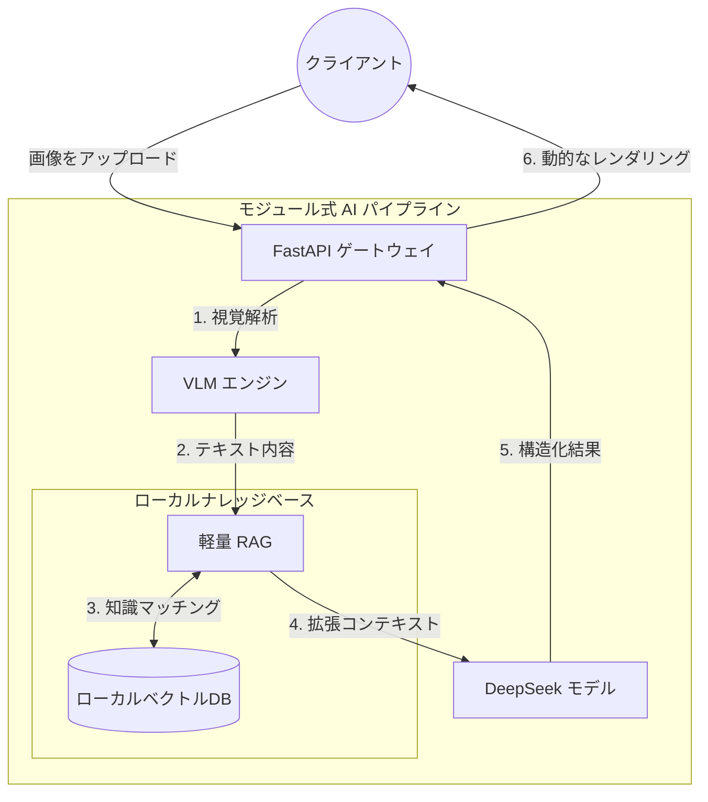

<div align="center">

<h1>MiniRAGuard</h1>

<p>
    <strong>監査およびコンプライアンス審査のためのフルスタック多モーダル RAG テンプレート</strong>
</p>

<p>
    <a href="https://github.com/KardeniaPoyu/MiniRAGuard/stargazers"></a>
    <a href="https://github.com/KardeniaPoyu/MiniRAGuard/network/members"></a>
    <a href="https://opensource.org/licenses/MIT"></a>
</p>

<p>
    
    
    
    
</p>

[**English**](./README.md) | [**简体中文**](./README_zh.md) | [**日本語**](./README_ja.md)

</div>

---

## 概要

MiniRAGuard は、視覚大モデル（VLM）と検索拡張生成（RAG）を統合したフルスタック技術テンプレートです。垂直ドメインにおけるドキュメント監査、コンプライアンス審査、および自動構造化解析のための標準化された実装を提供します。

## 技術的特徴

- **知識ベースに基づく検索拡張 (RAG)**: Sentence-Transformers とローカルベクトルデータベースを利用し、モデルの推論を事前定義された規則に厳密に依存させることで、ハルシネーションを抑制します。
- **多モーダルドキュメント解析**: VLM インターフェース（デフォルトで Qwen-VL）を統合し、スキャンデータ、画像、PDF からの自動構造化データ抽出を実現します。
- **監査ワークフローの制約**: 法律や財務監査などの機密性の高いビジネスシナリオにおいて、モデルの出力境界を定義するための「審査・フィードバック」プロンプトテンプレートを内蔵しています。

## デモ (Demo)

組み込みの賃貸コンプライアンスアシスタントのビデオデモ：

https://github.com/user-attachments/assets/28709a21-b789-4ed4-9fc6-ffad16611da7

## エンジニアリングコンポーネント
  - **バックエンド**: FastAPI を使用した高性能非同期 API。
  - **フロントエンド**: UniApp/Vue を使用したクロスプラットフォームビジネスインターフェース。
- **システムの安定性と最適化**:
  - **リクエストキャッシュ**: MD5 ベースのファイル検証により、重複リクエストを遮断し、API コストを削減します。
  - **並行制御**: セマフォベースのフロー制御により、LLM エンドポイントへの同時リクエスト数を制限し、サービスの安定性を確保します。

## 技術アーキテクチャ



## ディレクトリ構造

- `miniraguard/`: コアフレームワークの抽象化層。
- `examples/`: ビジネス実装例（賃貸コンプライアンスアシスタントなど）。
  - `backend/`: バックエンドビジネスロジック。
  - `frontend/`: フロントエンド UniApp ソースコード。
  - `data/`: 業務知識ベースとベクトルストレージ。
- `docs/`: 技術ドキュメント。

## クイックスタート

### 1. バックエンドのデプロイ

```bash
git clone https://github.com/KardeniaPoyu/MiniRAGuard.git
cd MiniRAGuard/examples/rent_assistant/backend
pip install -r ../../../requirements.txt 
cp .env.example .env # API_KEY を設定
python main.py
```

### 2. フロントエンドのデプロイ

1. HBuilderX に `examples/rent_assistant/frontend` をインポートします。
2. `config.js` の `BASE_URL` をバックエンドのアドレスに更新します。
3. 内蔵ブラウザまたは WeChat 開発者ツールで実行します。

## カスタマイズ

1. **知識の注入**: `examples/rent_assistant/data/` のファイルを独自の TXT または Markdown ファイルに置き換えます。
2. **インデックスのリセット**: `vector_store` ディレクトリを削除すると、次回の起動時にインデックスが再構築されます。
3. **ロジックの調整**: `backend/prompts.py` のシステムプロンプトを修正します。

## ライセンス

このプロジェクトは [MIT](LICENSE) ライセンスの下で公開されています。
