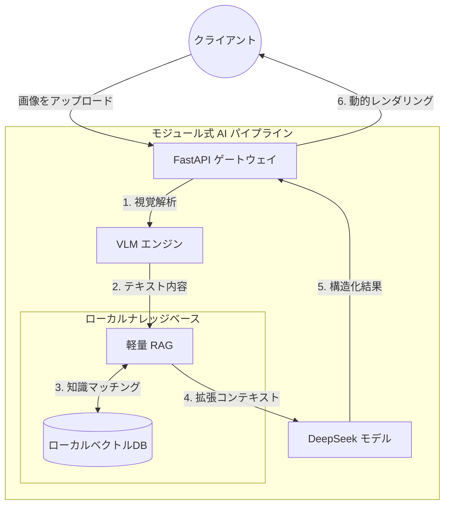

<div align="center">
  <!--  -->

  <h1>🛡️ MiniRAGuard</h1>

  <p>
    <strong>軽量フルスタック RAG 監査エージェントテンプレート</strong><br>
    <em>わずか 10 分で、独自の垂直領域マルチモーダル AI RAG 監査アシスタントを構築。</em>
  </p>

  <p>
    <a href="https://github.com/KardeniaPoyu/MiniRAGuard/stargazers"></a>
    <a href="https://github.com/KardeniaPoyu/MiniRAGuard/network/members"></a>
    <a href="https://github.com/KardeniaPoyu/MiniRAGuard/issues"></a>
    <a href="https://opensource.org/licenses/MIT"></a>
  </p>

  <p>
    
    
    
    
  </p>

[**English**](./README.md) | [**简体中文**](./README_zh.md) | [**日本語**](./README_ja.md)

</div>

<br/>

## 📖 目次

- [✨ MiniRAGuard とは？](#-miniraguard-とは)
- [🔥 核心的なハイライト](#-核心的なハイライト)
- [🏗️ 技術アーキテクチャ](#-技術アーキテクチャ)
- [🚀 クイックスタート](#-クイックスタート)
- [🛠️ 独自の AI エージェントを構築する](#-独自の-ai-エージェントを構築する)
- [🤝 貢献とライセンス](#-貢献とライセンス)

---

## ✨ MiniRAGuard とは？

医療監査、財務報告、苦情審査などの**垂直監査領域**において、開発者は「画像の不鮮明さ」「LLM のハルシネーション（幻覚）」「高頻度のリクエスト処理」という 3 つの大きな課題に直面しています。

これらに対し、**MiniRAGuard** は**極めて軽量で、すぐに使える**フルスタック RAG ビジネステンプレートを提供します。**VLM (視覚大モデル)** と **RAG (検索拡張生成)** を組み合わせ、AI がローカルのナレッジベースに基づいて厳密に推論することを強制。これにより、開発者はドキュメント検索と出力制限メカニズムを垂直領域のアプリケーションに迅速に組み込むことができます。

**MiniRAGuard** は、LLM を活用した複雑なドキュメント審査プロセスに対して、エンジニアリングにおける確定性と境界制御を提供することを目指しています。ミニマリストな RAG 実装だけでなく、完全なビジネスデモ UI も付属。**TXT ファイルをライブラリに追加し、プロンプトを修正するだけ**で、独自の AI アシスタントを即座に稼働させることができます。わずか 10 分で WeChat ミニプログラムやウェブサイトをデプロイでき、初心者の方が RAG アーキテクチャを学ぶのに最適です。

---

## 🚀 🚀 ビジネスデモ (Demo)

組み込みの **「領収書/契約コンプライアンスリスク監査アシスタント」** インスタンスのデモ：

<video src="./demo.mp4" width="100%" controls></video>

<br/>

## 🔥 核心的なハイライト

- **ローカルナレッジベースに基づく RAG 検索と生成 (Fact-based RAG)**  
  法務や財務などの厳格なシナリオ向けに、Sentence-Transformers を使用してローカルベクトルデータベース (VectorDB) を構築。LLM は推論前にローカルデータベースから関連する規制を検索することで、「ハルシネーション」を大幅に削減し、判断の具体的な根拠を提示します。
- **すぐに使えるマルチモーダルドキュメントアクセス**  
  主要な VLM インターフェース呼び出しロジック（デフォルト Qwen-VL API）を統合。契約書のスキャンデータ、画像、PDF を直接アップロードして重要情報を迅速に抽出できます。
- **軽量なコンプライアンス審査ワークフロー**  
  「審査・フィードバック」の基本プロンプトテンプレートを内蔵。賃貸契約書や定型条項などの機密テキストを処理する際の LLM の出力境界を効果的に制限し、ビジネス側の PoC に最適です。
- **フロントエンド・バックエンド分離の完全なビジネススキャフォールド**  
  `backend` (FastAPI) と `frontend` (Vue/UniApp) のエンジニアリング済みのソースコードを同梱。RAG の実装を学びながら、そのままデモとして利用できる UI も手に入ります。
- **並行処理とキャッシュ制御 (Concurrency & Caching)**
  - **MD5 キャッシュメカニズム**: ファイルの MD5 を計算して重複確認をインターセプト。不要な API トークン消費と遅延を大幅に削減します。
  - **セマフォ制限**: バックエンドのスレッドフロー制御により、トラフィックピーク時でも LLM への同時リクエスト数を制限し、安定した運用を確保します。

---

## 🏗️ 技術アーキテクチャ

高い凝集度と低い結合度の設計思想に基づき、スムーズなビジネスフローを実現：



---

## 🚀 クイックスタート

### 1. バックエンドのデプロイ

```bash
# 1. リポジトリをクローン
git clone https://github.com/KardeniaPoyu/MiniRAGuard.git
cd MiniRAGuard/backend

# 2. Python 依存関係のインストール
pip install -r requirements.txt

# 3. 環境設定 (API キーを入力)
cp .env.example .env

# 4. 起動！
python main.py
```
> 👉 `http://localhost:8000/docs` にアクセスして、インタラクティブな API ドキュメントを表示。

### 2. フロントエンドのデプロイ

1. [HBuilderX](https://www.dcloud.io/hbuilderx.html) IDE をダウンロード。
2. `frontend` ディレクトリをインポート。
3. `config.js` の `BASE_URL` を新しくデプロイしたバックエンドサービスに向けます。
4. 内蔵ブラウザまたは WeChat DevTools で実行！

---

## 🛠️ 独自の AI エージェントを構築する

1. **プライベートナレッジの注入**: `backend/data/` をクリアし、独自の TXT または Markdown マニュアルを追加します。
2. **ベクトルインデックスの再構築**: `vector_store/` ディレクトリを削除します。次回の起動時に自動的に再構築されます。
3. **ビジネスロジックの調整**: `backend/core/chat_tool.py` のシステムプロンプトを修正します。

---

## 📈 スター履歴

[](https://star-history.com/#KardeniaPoyu/MiniRAGuard&Date)

## 🤝 貢献とライセンス

誤字の修正でも、驚くようなプロダクションアプリの構築でも、プルリクエストをお待ちしています！詳細は [CONTRIBUTING.md](CONTRIBUTING.md) をご覧ください。

このプロジェクトは **[MIT](LICENSE)** ライセンスの下で公開されています。このプロジェクトが役立った場合は、⭐ **Star** をいただけると励みになります！
