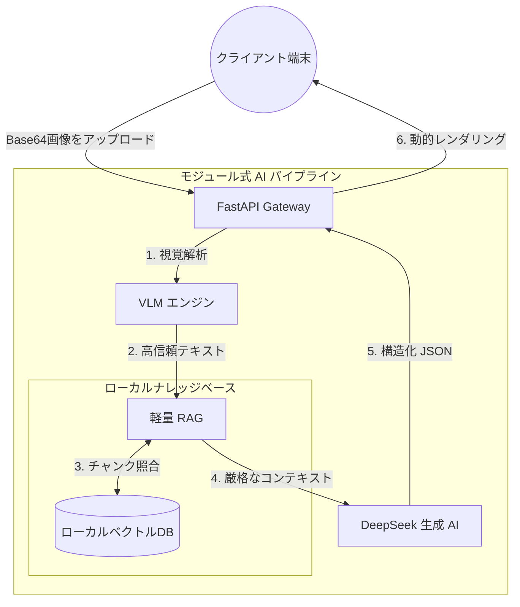

<div align="center">
  <!--  -->

  <h1>🛡️ MiniRAGuard</h1>

  <p>
    <strong>A Plug-and-Play Multimodal RAG Guardrail Framework</strong><br>
    <em>わずか 10 分で、誰でもゼロからエンタープライズ級のドキュメント AI ガードレールシステムを構築。</em>
  </p>

  <p>
    <a href="https://github.com/KardeniaPoyu/MiniRAGuard/stargazers"></a>
    <a href="https://github.com/KardeniaPoyu/MiniRAGuard/network/members"></a>
    <a href="https://github.com/KardeniaPoyu/MiniRAGuard/issues"></a>
    <a href="https://opensource.org/licenses/MIT"></a>
  </p>

  <p>
    
    
    
    
  </p>

[**English**](./README.md) | [**简体中文**](./README_zh.md) | [**日本語**](./README_ja.md)

</div>

<br/>

## 📖 目次

- [✨ MiniRAGuard とは？](#-miniraguard-とは)
- [🚀 デモ](#-デモ)
- [🔥 主な特徴](#-主な特徴)
- [🏗️ アーキテクチャ](#️-アーキテクチャ)
- [🚀 クイックスタート](#-クイックスタート)
- [🛠️ カスタムアプリの構築](#️-カスタムアプリの構築)
- [📈 スター履歴](#-スター履歴)
- [🤝 貢献とライセンス](#-貢献とライセンス)

---

## ✨ MiniRAGuard とは？

医療レビュー、財務監査、法務コンプライアンス、苦情処理など、様々な**垂直型監査領域**において、開発者は「画像の不鮮明さ」「LLM のハルシネーション（幻覚）」「高并发（高コンカレンシー）への対応」という 3 つの大きな課題に直面しています。

**MiniRAGuard** は、**軽量でプラグアンドプレイ**なオープンソースのフルスタックソリューション（バックエンド分析エンジン + クロスプラットフォームミニプログラム）を提供します。**VLM (大視覚モデル)** と **RAG (検索拡張生成)** を革新的に組み合わせ、AI がローカルナレッジベースに基づいて厳密に推論することを強制します。

「医療明細書インテリジェント監査アシスタント」でも「コミュニティ苦情分析端末」でも、**TXT ファイルをライブラリにドロップし、プロンプトを 1 つ修正するだけ**で、すぐに稼働させることができます。

---

## 🚀 🚀 デモ動画 (Video Demo)

組み込みの **「領収書/契約コンプライアンスガードレール」** インスタンスのデモ：

<video src="./demo.mp4" width="100%" controls></video>

<br/>

## 🔥 主な特徴

- **Qwen-VL API による高度な視覚抽出 (Vision LLM)**  
  Qwen-VL API を統合してドキュメントを認識。複雑なレイアウトや不鮮明な領収書における従来の OCR の誤認識を効果的に回避します。
- **監査信頼性のための RAG 推論ガードレール (Fact-based RAG)**  
  医療や財務などの厳格な領域向けに設計。Sentence-Transformers を介してプライベートベクトルベース (VectorDB) から検索することで、実質的な「インテリジェント監査」を行い、ハルシネーションを徹底的に排除します。
- **動的なキャッシュヒットと並行制御 (Performance & Reliability)**  
  - **MD5 熱キャッシュヒット**: アップロードされたファイルを自動的に指紋認証し、繰り返しタスクに対して **100% のキャッシュヒット**を実現。トークン消費と遅延を大幅に削減します。
  - **セマフォベースの並行性保護**: トラフィックの急増によるシステムクラッシュや API の制限を防ぎ、本番環境での高可用性を確保します。
- **即利用可能なフルスタックテンプレート (Full-Stack Support)**  
  FastAPI (バックエンド) と UniApp (フロントエンド) の完全なアーキテクチャを提供。開発者はシステムプロンプトを変更するだけで、他の監査シナリオに迅速にピボットできます。

---

## 🏗️ アーキテクチャ

高い凝集度と低い結合度の設計思想に基づいた、スムーズなビジネスフロー：



---

## 🚀 クイックスタート

AI アプリを構築する？わずか 10 分！

### 1. 高可用性バックエンドのデプロイ

```bash
# 1. リポジトリをクローン
git clone https://github.com/KardeniaPoyu/MiniRAGuard.git
cd MiniRAGuard/backend

# 2. Python 依存関係のインストール
pip install -r requirements.txt

# 3. 環境設定 (API キーを入力)
cp .env.example .env

# 4. 起動！
python main.py
```
> 👉 `http://localhost:8000/docs` にアクセスして、インタラクティブな API ドキュメントを表示。

### 2. クロスプラットフォームクライアント（フロントエンド）のデプロイ

1. [HBuilderX](https://www.dcloud.io/hbuilderx.html) IDE をダウンロード。
2. `frontend` ディレクトリをインポート。
3. `config.js` の `BASE_URL` を新しくデプロイしたバックエンドサービスに向けます。
4. 内蔵ブラウザまたは WeChat DevTools で安全に実行！

---

## 🛠️ カスタムアプリの構築
このフレームワークを 3 つのステップで独自の垂直ツールに変えましょう：

1. **プライベートナレッジの注入**: `backend/data/` ディレクトリをクリアし、ビジネスに関係のある TXT または Markdown マニュアルをドロップします。
2. **キャッシュとベクトルの再構築**: `backend/cache.db` と `vector_store/` ディレクトリを削除します。システムは次回の起動時に新しい知識を自動的に「消化」します。
3. **プロンプトの修正**: `backend/core/chat_tool.py` を開き、上部のシステムプロンプトを変更します（例：「リスクコントロールアドバイザー」から「病院の請求監査員」へ）。

---

## 📈 スター履歴

[](https://star-history.com/#KardeniaPoyu/MiniRAGuard&Date)

---

## 🤝 貢献とライセンス

**「オープンソース精神に賛辞を。」**

誤字の修正でも、驚くようなプロダクションアプリの構築でも、プルリクエストをお待ちしています！詳細は [CONTRIBUTING.md](CONTRIBUTING.md) をご覧ください。

このプロジェクトは **[MIT](LICENSE)** ライセンスの下で公開されています。このプロジェクトが役立った場合は、⭐ **Star** をいただけると励みになります！

