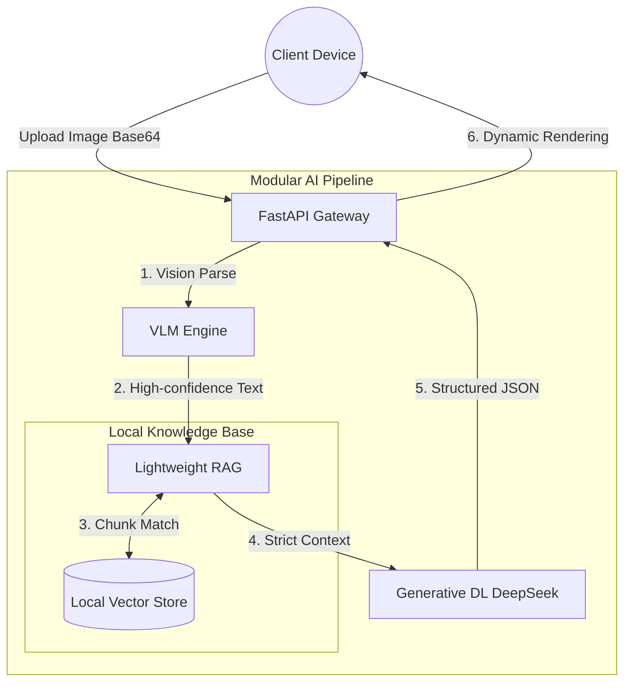

<div align="center">
  <!--  -->

  <h1>馃洝锔?MiniRAGuard</h1>

  <p>
    <strong>A Plug-and-Play Multimodal RAG Guardrail Framework</strong><br>
    <em>璁╀换浣曚汉鐢?10 鍒嗛挓锛屼粠闆舵瀯寤轰紒涓氱骇鏂囨。鏅鸿兘椋庢帶绯荤粺銆?/em>
  </p>

  <p>
    <a href="https://github.com/KardeniaPoyu/MiniRAGuard/stargazers"></a>
    <a href="https://github.com/KardeniaPoyu/MiniRAGuard/network/members"></a>
    <a href="https://github.com/KardeniaPoyu/MiniRAGuard/issues"></a>
    <a href="https://opensource.org/licenses/MIT"></a>
  </p>

  <p>
    
    
    
    
  </p>

[**English**](./README.md) | [**绠€浣撲腑鏂?*](./README_zh.md)

</div>

<br/>

## 馃摉 Table of Contents

- [鉁?What is MiniRAGuard?](#-what-is-miniraguard)
- [馃殌 Live Demo](#-live-demo)
- [馃敟 Key Features](#-key-features)
- [馃彈锔?Architecture](#锔?architecture)
- [馃殌 Quick Start](#-quick-start)
- [馃洜锔?Build Your Own App](#锔?build-your-own-app)
- [馃搱 Star History](#-star-history)
- [馃 Contributing & License](#-contributing--license)

---

## 鉁?What is MiniRAGuard?

鍦ㄥ悇绫诲瀭鐩撮鍩燂紙鍖荤枟瀹℃牳銆佽储鍔℃姤琛ㄣ€佷俊璁跨淮鏉冦€佸悎鍚屾硶鍔★級锛屾垜浠粡甯搁潰涓翠笁澶ч樆纰嶏細**鍥剧墖鏁版嵁妯＄硦**銆?*澶фā鍨嬪够瑙夐鍙?*銆?*楂樺苟鍙戦毦浠ユ壙杞?*銆?

**MiniRAGuard** 鎻愪緵浜嗕竴涓?*鏋佽交閲忋€佸紑绠卞嵆鐢?*鐨勫紑婧愬叏鏍堣В鍐虫柟妗堬紙鍚庣鍒嗘瀽寮曟搸 + 璺ㄧ灏忕▼搴忥級銆傚畠鍒涙柊鎬у湴缁撳悎浜?**VLM (澶ц瑙夋ā鍨?** 鍜?**RAG (妫€绱㈠寮虹敓鎴?**锛屽己鍒?AI 鍩轰簬浣犵殑鏈湴鐭ヨ瘑搴撹繘琛屼簨瀹炴帹鐞嗐€?

鏃犺浣犳槸鎯虫惌寤轰竴涓€滃尰鐤楀崟鎹櫤瀹″姪鎵嬧€濓紝杩樻槸鈥滅ぞ鍖烘皯鎯呯爺鍒ゆ€绘満鈥濓紝鍙渶**鎵旇繘浣犵殑 TXT 搴擄紝淇敼涓€娈?Prompt**锛屽嵆鍙珛鍒讳笂绾裤€?

---

## 馃殌 Live Demo

浠ヨ嚜甯︾殑 **鈥滃崟鎹?鍚堝悓鍚堣椋庢帶鍔╂墜鈥?* 瀹炰緥涓烘紨绀猴細

https://github.com/KardeniaPoyu/MiniRAGuard/raw/main/demo.mp4

<br/>

## 馃敟 Key Features

- **鍩轰簬 Qwen-VL API 鐨勮瑙夋彁鍙?(Vision LLM)**
  绯荤粺璋冪敤 Qwen-VL API 杩涜鍥惧儚淇℃伅鐨勮瘑鍒笌鎻愬彇锛岀浉杈冧簬浼犵粺 OCR 鑳藉鏇村ソ鍦板鐞嗗寘鍚鏉傛帓鐗堛€佹墜鍐欏瓧浣撴垨鐢昏川涓嶄匠鐨勬簮鏂囨。锛屾彁鍗囬潪缁撴瀯鍖栧浘鍍忕殑鏂囨湰杞崲鍑嗙‘鐜囥€?
- **缁撳悎鏈湴鐭ヨ瘑搴撶殑 RAG 妫€绱㈢敓鎴?(Fact-based RAG)**
  閽堝娉曞姟銆佽储鍔＄瓑涓ヨ們鍦烘櫙锛岀郴缁熶娇鐢?Sentence-Transformers 鏋勫缓鏈湴鍚戦噺鏁版嵁搴擄紙VectorDB锛夈€傚ぇ妯″瀷鍦ㄨ繘琛屾帹鐞嗗墠浼氫紭鍏堜粠鏈湴鏁版嵁搴撴绱㈢浉鍏崇殑瑙勮寖鏉′緥锛屼粠鑰屽噺灏戝父璇嗘€р€滃够瑙夆€濆苟鎻愪緵鍏蜂綋鐨勫垽鏂嚭澶勩€?
- **鍩烘湰骞跺彂涓庣紦瀛樻帶鍒?(Concurrency & Caching)**
  - **MD5 缂撳瓨鏈哄埗**锛氳绠楁枃浠?MD5锛屾嫤鎴噸澶嶆枃浠剁殑鏍￠獙璇锋眰骞剁洿鎺ヨ繑鍥炴湰鍦扮紦瀛橈紝鍑忓皯涓嶅繀瑕佺殑 LLM API 璋冪敤寮€閿€鍙婂搷搴旀椂闂淬€?
  - **骞跺彂淇″彿閲忔帶鍒?*锛氬悗绔儴缃蹭簡鍩轰簬淇″彿閲忕殑绾跨▼娴佹帶鏈哄埗锛岄檺鍒堕珮骞跺彂鍦烘櫙涓嬫姏鍚戝ぇ妯″瀷鐨勫苟鍙戞暟锛屼繚闅滄湇鍔＄ǔ瀹氳繍琛屻€?
- **鍓嶅悗绔垎绂绘灦鏋?(Full-Stack Support)**
  鎻愪緵鍩轰簬 FastAPI 鐨勭函寮傛鏈嶅姟绔紝浠ュ強浣跨敤 Vue/UniApp 缂栧啓鐨勮法骞冲彴瀹㈡埛绔唬鐮侊紙鏀寔 Web 鍙婂井淇″皬绋嬪簭锛夛紝寮€鍙戣€呴儴缃插悗鍗冲彲鐩存帴浣跨敤瀹屾暣涓氬姟娴併€?

---

## 馃彈锔?Architecture

绉夋壙楂樺唴鑱氥€佷綆鑰﹀悎鐨勪紭闆呰璁＄悊蹇碉紝涓氬姟娴佸涓濊埇椤烘粦锛?



---

## 馃殌 Quick Start

鏋勫缓浣犵殑 AI 搴旂敤锛熷彧闇€鍗佸垎閽燂紒

### 1. 閮ㄧ讲楂樺彲鐢ㄥ悗绔?(Backend)

```bash
# 1. 鍏嬮殕浠ｇ爜浠撳簱
git clone https://github.com/KardeniaPoyu/MiniRAGuard.git
cd MiniRAGuard/backend

# 2. 瀹夎 Python 渚濊禆 
pip install -r requirements.txt

# 3. 鐜鍙橀噺閰嶇疆 (濉叆浣犵殑 API KEY)
cp .env.example .env

# 4. 涓€閿捣椋烇紒
python main.py
```
> 馃憠 璁块棶 `http://localhost:8000/docs` 鏌ョ湅浜や簰寮?API 鏂囨。銆?

### 2. 閮ㄧ讲璺ㄧ瀹㈡埛绔?(Frontend)

1. 涓嬭浇 [HBuilderX](https://www.dcloud.io/hbuilderx.html) IDE銆?
2. 灏?`frontend` 鐩綍瀵煎叆銆?
3. 淇敼 `config.js` 涓殑 `BASE_URL` 涓轰綘鍒氬垰閮ㄧ讲鐨勫悗绔湇鍔″湴鍧€銆?
4. 涓€閿繍琛岃嚦鍐呯疆娴忚鍣ㄦ垨寰俊寮€鍙戣€呭伐鍏凤紒

---

## 馃洜锔?Build Your Own App
鎶婅繖濂楁鏋跺彉鎴愪綘鐨勪笓灞炲埄鍣紒榛勯噾涓夋璧帮細

1. **娉ㄥ叆绉佹湁鐭ヨ瘑**锛氭竻绌?`backend/data/` 鐩綍锛屾墧杩涚鍚堜綘涓氬姟鍦烘櫙鐨?TXT 鎴?Markdown 鎵嬪唽銆?
2. **娓呯悊缂撳瓨閲嶅**锛氬垹闄?`backend/cache.db` 鍜?`vector_store/` 鐩綍锛岀郴缁熶笅娆″惎鍔ㄥ皢鑷姩鈥滄秷鍖栤€濇柊鐭ヨ瘑銆?
3. **娉ㄥ叆鐏甸瓊 Prompt**锛氭墦寮€ `backend/core/chat_tool.py`锛屾洿鏀归《鏍忕殑 System Prompt 瀹氫綅銆傦紙姣斿浠庘€滈鎺ч【闂€濇敼鎴愨€滀笁鐢插尰闄㈣储鍔℃姤閿€瀹℃牳鍛樷€濓級銆?

---

## 馃搱 Star History

[](https://star-history.com/#KardeniaPoyu/MiniRAGuard&Date)

---

## 馃 Contributing & License

**鈥滄垜璧炵編寮€婧愮簿绁炪€傗€?*

鏃犺浣犳槸淇ˉ浜嗕竴涓嫾鍐欓敊璇紝杩樻槸鍦ㄤ綘鐨勪笟鍔′腑鐢?MiniRAGuard 鍋氬嚭浜嗘儕鑹崇殑钀藉湴搴旂敤锛屾垜浠兘鏈熷緟浣犵殑 Pull Request锛佽瑙?[CONTRIBUTING.md](CONTRIBUTING.md)銆?

鏈」鐩噰鐢?**[MIT](LICENSE)** 寮€婧愬崗璁€傚鏋滀綘瑙夊緱杩欎釜椤圭洰瀵逛綘鏈夊府鍔╋紝涓嶅Θ鐐逛竴涓?猸?**Star** 榧撳姳涓€涓嬩綔鑰咃紒

<div align="center">
  <i>Made with 鉂わ笍 by the MiniRAGuard Team</i>
</div>
