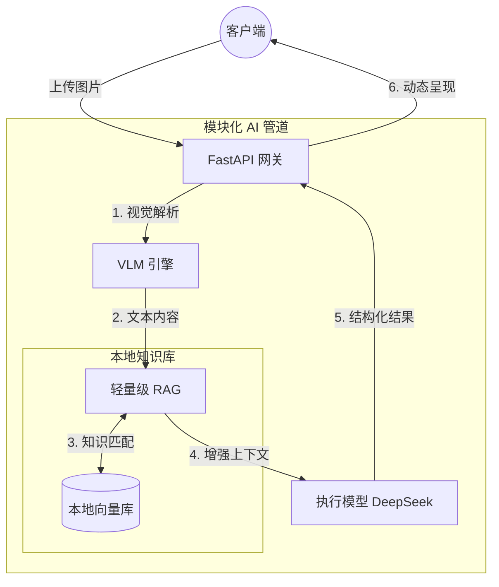

<div align="center">
  <!--  -->

  <h1>🛡️ MiniRAGuard</h1>

  <p>
        <strong>轻量级全栈 RAG 审查智能体模板</strong><br>
    <em>让任何人用 10 分钟，快速搭建属于自己的垂直领域多模态 AI RAG 审查助手。</em>
  </p>

  <p>
    <a href="https://github.com/KardeniaPoyu/MiniRAGuard/stargazers"></a>
    <a href="https://github.com/KardeniaPoyu/MiniRAGuard/network/members"></a>
    <a href="https://github.com/KardeniaPoyu/MiniRAGuard/issues"></a>
    <a href="https://opensource.org/licenses/MIT"></a>
  </p>

  <p>
    
    
    
    
  </p>

[**English**](./README.md) | [**简体中文**](./README_zh.md) | [**日本語**](./README_ja.md)

</div>

<br/>

## 📖 目录

- [✨ 什么是 MiniRAGuard？](#-什么是-miniraguard)
- [🏗️ 目录结构](#-目录结构)
- [🚀 快速开始](#-快速开始)
- [🔥 核心功能](#-核心功能)
- [🏗️ 技术架构](#-技术架构)
- [🤝 贡献与许可](#-贡献与许可)

---

## ✨ 什么是 MiniRAGuard？

针对垂直审核领域的痛点，**MiniRAGuard** 提供了一个**极轻量、开箱即用**的全栈 RAG 业务模板。它采用了**核心框架 (miniraguard) 与业务 Demo (examples) 分离**的架构，确保工程上的确定性与边界控制。

只需**提供你的业务 Prompt 并注入知识库**，即可上线属于你的垂直领域助手。项目非常方便初学者学习 RAG 架构及部署上线。

---

## 🚀 业务实例演示 (Demo)

自带的项目落地 Demo： **“租房/合同合规风控助手”** 位于 `examples/rent_assistant` 目录下。

[**点击查看演示视频 (GitHub Issue 附件)**](https://github.com/KardeniaPoyu/MiniRAGuard/issues/1)

<br/>

## 🔥 核心功能

- **Fact-based RAG 检索生成**：利用 `miniraguard` 核心引擎，结合 Sentence-Transformers 本地向量库，有效减少幻觉。
- **开箱即用的多模态接入**：默认集成 Qwen-VL API，轻松处理扫描件/图片。
- **物理隔离的业务逻辑**：业务代码与框架代码彻底分离，方便二次开发。
- **全栈移动端脚手架**：配套 UniApp (Vue) 移动端源码，支持微信小程序。

---

## 🏗️ 目录结构 (Structure)

```text
.
├── miniraguard/          # 核心框架代码 (Abstract Core)
├── examples/
│   └── rent_assistant/   # 官方落地 Demo (Rental Assistant)
│       ├── backend/      # 业务逻辑实现
│       ├── frontend/     # UniApp 移动端源码
│       └── data/         # 业务知识库/向量库存储
├── docs/                 # 项目文档
└── tests/                # 单元测试
```

---

## 🚀 快速开始 (以租房助手 Demo 为例)

### 1. 部署后端 (Backend)

```bash
# 1. 克隆并进入目录
git clone https://github.com/KardeniaPoyu/MiniRAGuard.git
cd MiniRAGuard/examples/rent_assistant/backend

# 2. 安装依赖并配置环境
pip install -r ../../../requirements.txt 
cp .env.example .env # 填入你的 API KEY

# 3. 启动！
python main.py
```

### 2. 部署前端 (Frontend)

1. 下载并安装 [HBuilderX](https://www.dcloud.io/hbuilderx.html) IDE。
2. 将 `examples/rent_assistant/frontend` 目录导入。
3. 修改 `config.js` 中的 `BASE_URL` 为你刚刚部署的后端服务地址。
4. 一键运行至内置浏览器或微信开发者工具！

---

## 🏗️ 技术架构



---

## 🛠️ 打造属于你的 AI 智能体

1. **注入私有知识**：清空 `examples/rent_assistant/data/`，放入你的 TXT 或 Markdown 手册。
2. **重建向量索引**：删除原有 `vector_store` 目录，下次启动将自动重新构建（需相应 scripts）。
3. **调整业务逻辑**：修改 `examples/rent_assistant/backend/prompts.py` 中的 System Prompt。

---

## 📈 Star History

[](https://star-history.com/#KardeniaPoyu/MiniRAGuard&Date)

## 🤝 参与贡献与开源协议

无论你是修补了一个拼写错误，还是在你的业务中用 MiniRAGuard 做出了惊艳的落地应用，我们都期待你的 Pull Request！详见 [CONTRIBUTING.md](CONTRIBUTING.md)。

本项目采用 **[MIT](LICENSE)** 开源协议。如果你觉得这个项目对你有帮助，不妨点一个 ⭐ **Star** 鼓励一下作者！
