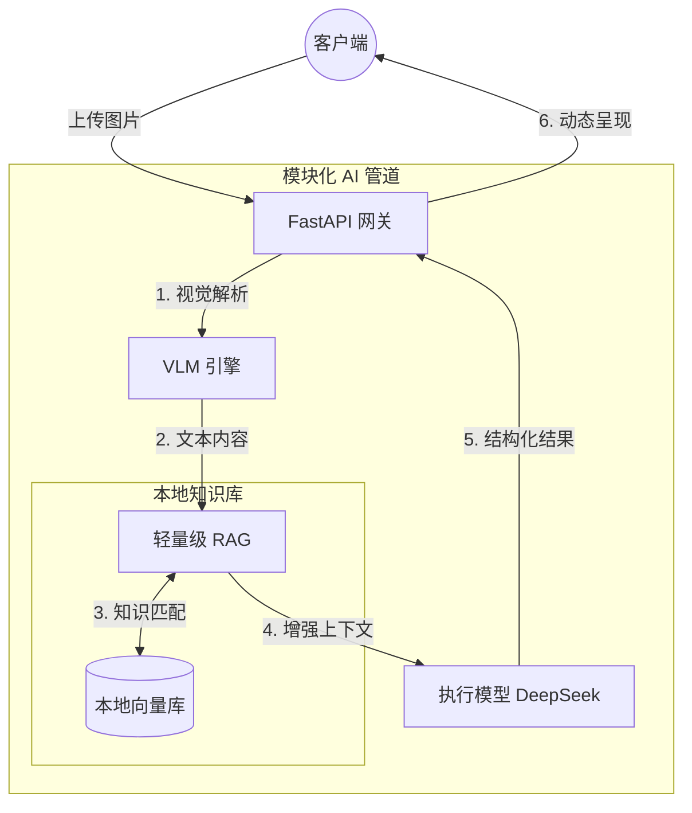

<div align="center">
  <!--  -->

  <h1>🛡️ MiniRAGuard</h1>

  <p>
    <strong>轻量级全栈 RAG 智能体模板 (含 Vue + FastAPI 完整源码)</strong><br>
    <em>以租房中介与合同合规审查为官方 Demo，助你快速搭建属于自己的垂直领域多模态 AI 助手。</em>
  </p>

  <p>
    <a href="https://github.com/KardeniaPoyu/MiniRAGuard/stargazers"></a>
    <a href="https://github.com/KardeniaPoyu/MiniRAGuard/network/members"></a>
    <a href="https://github.com/KardeniaPoyu/MiniRAGuard/issues"></a>
    <a href="https://opensource.org/licenses/MIT"></a>
  </p>

  <p>
    
    
    
    
  </p>

[**English**](./README.md) | [**简体中文**](./README_zh.md) | [**日本語**](./README_ja.md)

</div>

<br/>

## 📖 目录

- [✨ 什么是 MiniRAGuard？](#-什么是-miniraguard)
- [🔥 核心亮点](#-核心亮点)
- [🏗️ 技术架构](#-技术架构)
- [🚀 快速开始](#-快速开始)
- [🛠️ 打造属于你的 AI 智能体](#-打造属于你的-ai-智能体)
- [🤝 贡献与许可](#-贡献与许可)

---

## ✨ 什么是 MiniRAGuard？

在医疗审核、财务报表、信访审查等**垂直审核领域**，开发者常面临三大痛点：**图像数据模糊无序**、**LLM 幻觉频发**、**高并发请求难处理**。

**MiniRAGuard** 提供了一个**极轻量、开箱即用**的开源全栈智能体模板。它创新地将 **VLM（视觉大模型）** 与 **RAG（检索增强生成）** 相结合，强迫 AI 严格基于你的本地知识库进行推理。

不仅是一个简单的 RAG 实现，它还自带了完整的业务展示界面。只需**将 TXT 放入库中并修改一段 Prompt**，即可上线属于你的垂直领域助手。

---

## 🔥 核心亮点

- **开箱即用的多模态文档接入**  
  集成了主流的 VLM 接口调用逻辑，支持直接上传合同扫描件、图片或 PDF，快速提取关键信息，开发者无需从零编写复杂的多模态解析代码。
- **轻量级合规审查工作流**  
  内置了一套基础的“审查-反馈” Prompt 模板设计，能有效约束大模型在处理敏感文本（如租约、格式条款）时的输出边界，非常适合进行业务侧的 PoC（概念验证）。
- **前后端分离的完整业务脚手架**  
  提供 `backend` (FastAPI) 和 `frontend` (Vue/UniApp) 完整的工程化源码。开发者不仅能学到 RAG 怎么写，还能直接拥有一套可以直接向老板或导师演示的 UI 界面。
- **并发与缓存控制机制**
  - **MD5 缓存机制**：通过计算文件 MD5 拦截重复审核，减少 API Token 消耗。
  - **信号量限流**：后端限流机制，在流量高峰时保证服务稳定。

---

## 🏗️ 技术架构

秉持高内聚低耦合的设计理念：



---

## 🚀 快速开始

### 1. 部署后端 (Backend)

```bash
cd backend
pip install -r requirements.txt
cp .env.example .env
# 编辑 .env 填入 API Keys
python main.py
```

### 2. 部署前端 (Frontend)

1. 使用 [HBuilderX](https://www.dcloud.io/hbuilderx.html) 打开 `frontend` 目录。
2. 运行至浏览器。

---

## 🛠️ 打造属于你的 AI 智能体

1. **注入私有知识**：清空 `backend/data/`，放入你的 TXT 或 Markdown 手册。
2. **重建向量索引**：删除 `vector_store/` 目录，下次启动将自动重新构建。
3. **调整业务逻辑**：修改 `backend/core/chat_tool.py` 中的 System Prompt。

---

## 🤝 贡献与许可

本项目采用 **[MIT](LICENSE)** 开源协议。欢迎提交 Pull Request！
