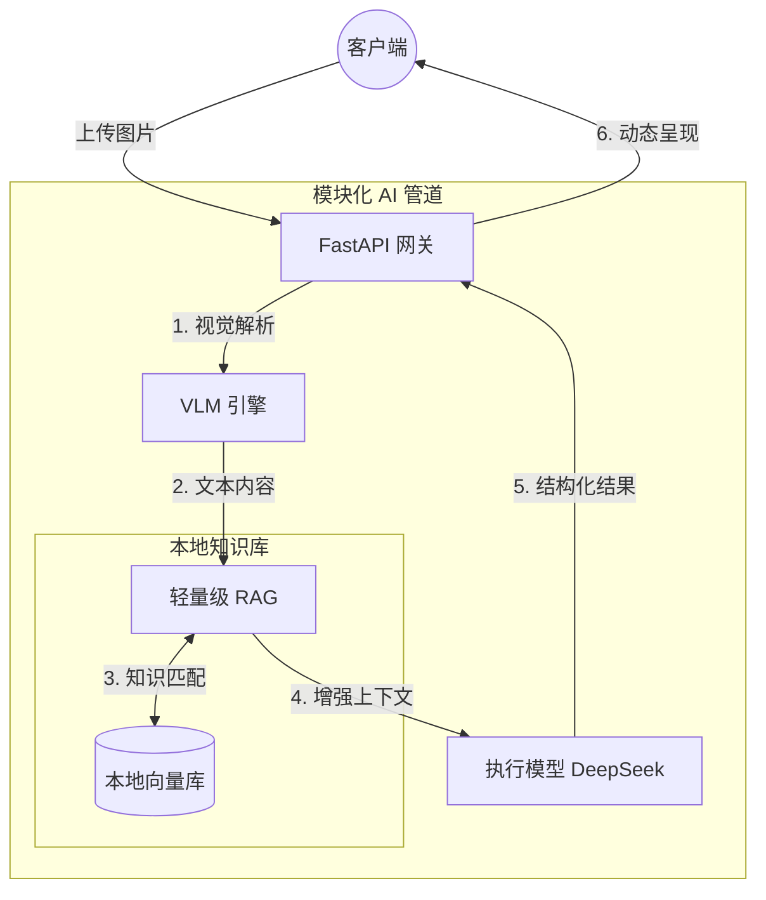

  <!--  -->

  <h1>🛡️ MiniRAGuard</h1>

  

        <strong>轻量级全栈 RAG 审查智能体模板</strong> 
    <em>让任何人用 10 分钟，快速搭建属于自己的垂直领域多模态 AI RAG 审查助手。</em>
  

  

    
    
    
    
  

  

    
    
    
    
  

[**English**](./README.md) | [**简体中文**](./README_zh.md) | [**日本語**](./README_ja.md)

 

## 📖 目录

- [✨ 什么是 MiniRAGuard？](#-什么是-miniraguard)
- [🏗️ 目录结构](#-目录结构)
- [🚀 快速开始](#-快速开始)
- [🔥 核心功能](#-核心功能)
- [🏗️ 技术架构](#-技术架构)
- [🛠️ 打造属于你的 AI 智能体](#-打造属于你的 AI 智能体)
- [🤝 贡献与许可](#-贡献与许可)

---

## ✨ 什么是 MiniRAGuard？

在医疗审核、财务报表、信访审查等**垂直审核领域**，开发者常面临三大痛点：**图像数据模糊无序**、**LLM 幻觉频发**、**高并发请求难处理**。

针对这三点，**MiniRAGuard** 提供了一个**极轻量、开箱即用**的全栈 RAG 业务模板。它将 **VLM（视觉大模型）** 与 **RAG（检索增强生成）** 相结合，强迫 AI 严格基于你的本地知识库进行推理，帮助开发者快速为垂直领域应用接入文档检索与输出约束机制。

**MiniRAGuard** 旨在为 LLM 赋能的复杂文档审查流程提供工程上的确定性与边界控制。它不仅包含一个极简的 RAG 实现，还自带了完整的业务展示界面。只需**将 TXT 放入库中并修改一段 Prompt**，即可上线属于你的垂直领域助手，十分钟完成一个微信小程序/网站的上线及部署，非常方便初学者学习 RAG 架构。

---

## 🚀 业务实例演示 (Demo)

自带的项目落地 Demo： **“租房/合同合规风控助手”** 位于 `examples/rent_assistant` 目录下。

https://github.com/KardeniaPoyu/MiniRAGuard/issues/1

 

## 🔥 核心功能

- **结合本地知识库的 RAG 检索生成 (Fact-based RAG)**
  针对法务、财务等严肃场景，系统使用 Sentence-Transformers 构建本地向量数据库（VectorDB）。大模型在进行推理前会优先从本地数据库检索相关的规范条例，从而减少常识性“幻觉”并提供具体的判断出处。
- **开箱即用的多模态文档接入**  
  集成了主流的 VLM 接口调用逻辑（默认Qwen-VL API），支持直接上传合同扫描件、图片或 PDF，快速提取关键信息，开发者无需从零编写复杂的多模态解析代码。
- **轻量级合规审查工作流**  
  内置了一套基础的“审查-反馈” Prompt 模板设计，能有效约束大模型在处理敏感文本（如租约、格式条款）时的输出边界，非常适合进行业务侧的 PoC（概念验证）。
- **前后端分离的完整业务脚手架**  
  提供 `backend` (FastAPI) 和 `frontend` (Vue/UniApp) 完整的工程化源码。开发者不仅能学到 RAG 怎么写，还能直接拥有一套可以直接向老板或导师演示的 UI 界面。
- **基本并发与缓存控制 (Concurrency & Caching)**
  - **MD5 缓存机制**：计算文件 MD5，拦截重复文件的校验请求并直接返回本地缓存，减少不必要的 LLM API 调用开销及响应时间。
  - **并发信号量控制**：后端部署了基于信号量的线程流控机制，限制高并发场景下抛向大模型的并发数，保障服务稳定运行。

---

## 🏗️ 技术架构

---

## 🛠️ 打造属于你的 AI 智能体

1. **注入私有知识**：清空 `examples/rent_assistant/data/`，放入你的 TXT 或 Markdown 手册。
2. **重建向量索引**：删除原有 `vector_store` 目录，下次启动将自动重新构建（需相应 scripts）。
3. **调整业务逻辑**：修改 `examples/rent_assistant/backend/prompts.py` 中的 System Prompt。

---

## 📈 Star History

## 🤝 参与贡献与开源协议

无论你是修补了一个拼写错误，还是在你的业务中用 MiniRAGuard 做出了惊艳的落地应用，我们都期待你的 Pull Request！详见 [CONTRIBUTING.md](CONTRIBUTING.md)。

本项目采用 **[MIT](LICENSE)** 开源协议。如果你觉得这个项目对你有帮助，不妨点一个 ⭐ **Star** 鼓励一下作者！
