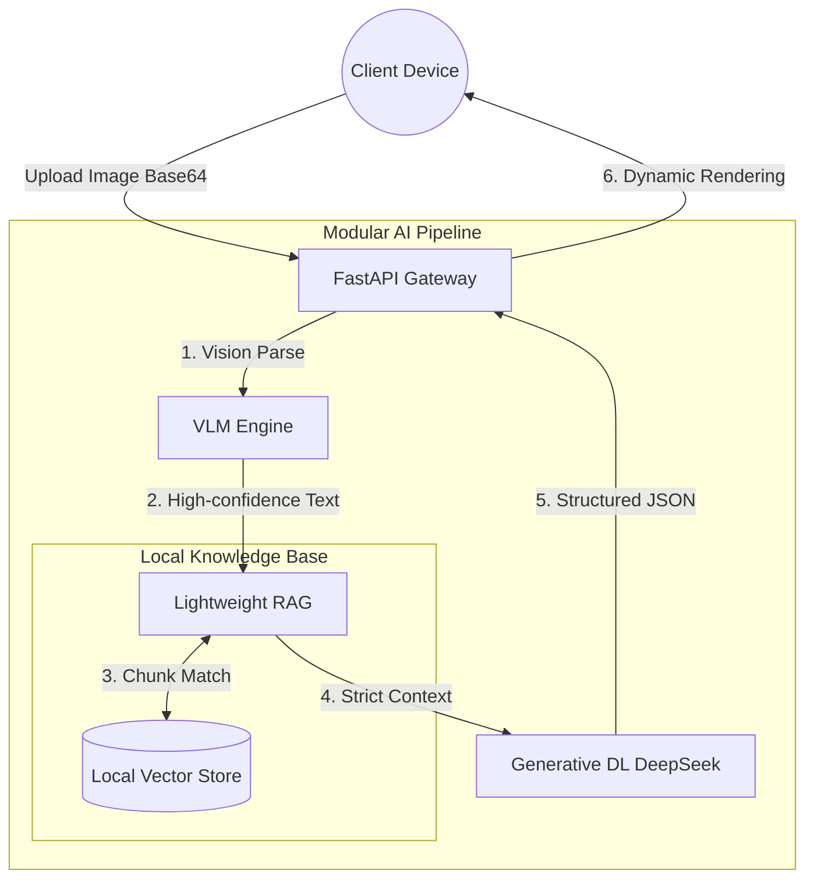

<div align="center">
  <!--  -->

  <h1>🛡️ MiniRAGuard</h1>

  <p>
    <strong>A Plug-and-Play Multimodal RAG Guardrail Framework</strong><br>
    <em>让任何人用 10 分钟，从零构建企业级文档智能风控系统。</em>
  </p>

  <p>
    <a href="https://github.com/KardeniaPoyu/MiniRAGuard/stargazers"></a>
    <a href="https://github.com/KardeniaPoyu/MiniRAGuard/network/members"></a>
    <a href="https://github.com/KardeniaPoyu/MiniRAGuard/issues"></a>
    <a href="https://opensource.org/licenses/MIT"></a>
  </p>

  <p>
    
    
    
    
  </p>

[**English**](./README.md) | [**简体中文**](./README_zh.md)

</div>

<br/>

## ✨ 什么是 MiniRAGuard?

在各类垂直领域（医疗审核、财务报表、信访维权、合同法务），我们经常面临三大阻碍：**图片数据模糊**、**大模型幻觉频发**、**高并发难以承载**。

**MiniRAGuard** 提供了一个**极轻量、开箱即用**的开源全栈解决方案（后端分析引擎 + 跨端小程序）。它创新性地结合了 **VLM (大视觉模型)** 和 **RAG (检索增强生成)**，强制 AI 基于你的本地知识库进行事实推理。

无论你是想搭建一个“医疗单据智审助手”，还是“社区民情研判总机”，只需**扔进你的 TXT 库，修改一段 Prompt**，即可立刻上线。

---

## 🚀 业务实例演示 (Demo)

以自带的 **“单据/合同合规风控助手”** 实例为演示：

https://github.com/KardeniaPoyu/MiniRAGuard/raw/main/demo.mp4

<br/>

## 🔥 核心功能

- **基于 Qwen-VL API 的视觉提取 (Vision LLM)**
  系统调用 Qwen-VL API 进行图像信息的识别与提取，相较于传统 OCR 能够更好地处理包含复杂排版、手写字体或画质不佳的源文档，提升非结构化图像的文本转换准确率。
- **结合本地知识库的 RAG 检索生成 (Fact-based RAG)**
  针对法务、财务等严肃场景，系统使用 Sentence-Transformers 构建本地向量数据库（VectorDB）。大模型在进行推理前会优先从本地数据库检索相关的规范条例，从而减少常识性“幻觉”并提供具体的判断出处。
- **基本并发与缓存控制 (Concurrency & Caching)**
  - **MD5 缓存机制**：计算文件 MD5，拦截重复文件的校验请求并直接返回本地缓存，减少不必要的 LLM API 调用开销及响应时间。
  - **并发信号量控制**：后端部署了基于信号量的线程流控机制，限制高并发场景下抛向大模型的并发数，保障服务稳定运行。
- **前后端分离架构 (Full-Stack Support)**
  提供基于 FastAPI 的纯异步服务端，以及使用 Vue/UniApp 编写的跨平台客户端代码（支持 Web 及微信小程序），开发者部署后即可直接使用完整业务流。

---

## 🏗️ 技术架构

秉承高内聚、低耦合的优雅设计理念，业务流如丝般顺滑：



---

## 🚀 快速开始

构建你的 AI 应用？只需十分钟！

### 1. 部署高可用后端 (Backend)

```bash
# 1. 克隆代码仓库
git clone https://github.com/KardeniaPoyu/MiniRAGuard.git
cd MiniRAGuard/backend

# 2. 安装 Python 依赖 
pip install -r requirements.txt

# 3. 环境变量配置 (填入你的 API KEY)
cp .env.example .env

# 4. 一键起飞！
python main.py
```
> 👉 访问 `http://localhost:8000/docs` 查看交互式 API 文档。

### 2. 部署跨端客户端 (Frontend)

1. 下载 [HBuilderX](https://www.dcloud.io/hbuilderx.html) IDE。
2. 将 `frontend` 目录导入。
3. 修改 `config.js` 中的 `BASE_URL` 为你刚刚部署的后端服务地址。
4. 一键运行至内置浏览器或微信开发者工具！

---

## 🛠️ 打造你自己的应用
把这套框架变成你的专属利器！黄金三步走：

1. **注入私有知识**：清空 `backend/data/` 目录，扔进符合你业务场景的 TXT 或 Markdown 手册。
2. **清理缓存重塑**：删除 `backend/cache.db` 和 `vector_store/` 目录，系统下次启动将自动“消化”新知识。
3. **注入灵魂 Prompt**：打开 `backend/core/chat_tool.py`，更改顶栏的 System Prompt 定位。（比如从“风控顾问”改成“三甲医院财务报销审核员”）。

---

## 📈 Star History

[](https://star-history.com/#KardeniaPoyu/MiniRAGuard&Date)

---

## 🤝 参与贡献与开源协议

**“我赞美开源精神。”**

无论你是修补了一个拼写错误，还是在你的业务中用 MiniRAGuard 做出了惊艳的落地应用，我们都期待你的 Pull Request！详见 [CONTRIBUTING.md](CONTRIBUTING.md)。

本项目采用 **[MIT](LICENSE)** 开源协议。如果你觉得这个项目对你有帮助，不妨点一个 ⭐ **Star** 鼓励一下作者！

