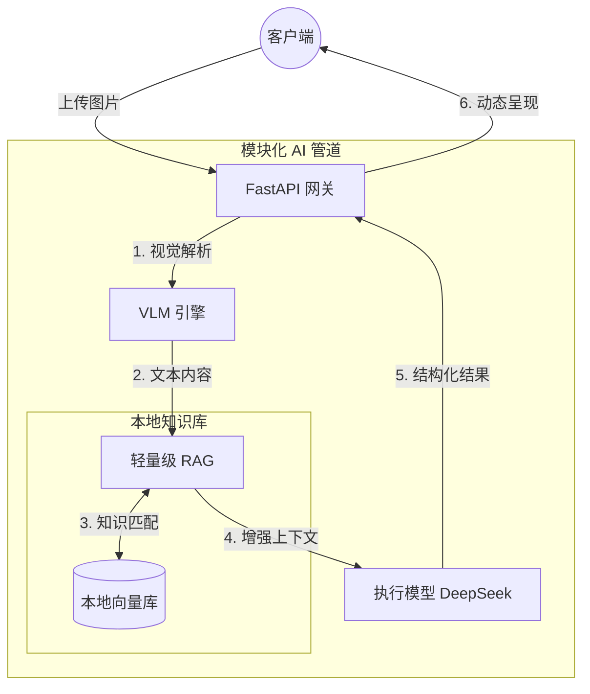

<div align="center">

<h1>MiniRAGuard</h1>

<p>
    <strong>全栈多模态 RAG 审计与合规审查模板</strong>
</p>

<p>
    <a href="https://github.com/KardeniaPoyu/MiniRAGuard/stargazers"></a>
    <a href="https://github.com/KardeniaPoyu/MiniRAGuard/network/members"></a>
    <a href="https://opensource.org/licenses/MIT"></a>
</p>

<p>
    
    
    
    
</p>

[**English**](./README.md) | [**简体中文**](./README_zh.md) | [**日本語**](./README_ja.md)

</div>

---

## 概述

MiniRAGuard 是一个集成视觉大模型（VLM）与检索增强生成（RAG）的技术模板，专为垂直领域的文档审计、合规性审查及自动化解析提供标准化的后端逻辑与前端交互实现。

## 技术特性

- **基于知识库的检索增强 (RAG)**：通过 Sentence-Transformers 与本地向量数据库，使模型推理过程严格依赖于预设的规范条例，降低生成幻觉。
- **多模态文档解析**：集成 VLM 接口（默认支持 Qwen-VL），实现对扫描件、图片及 PDF 的自动化结构化数据提取。
- **审计工作流定义**：内置“审查-反馈”的 Prompt 模板，用于约束模型在敏感业务场景（如法务、财务）下的输出边界。

## 业务演示 (Demo)

自带的项目落地示例（租赁合同合规风控助手）视频演示：

https://github.com/user-attachments/assets/28709a21-b789-4ed4-9fc6-ffad16611da7

## 工程化组件
  - **后端**：基于 FastAPI 的高性能异步接口。
  - **前端**：基于 UniApp/Vue 的跨平台业务界面。
- **系统优化控制**：
  - **缓存机制**：基于文件 MD5 的请求拦截，减少重复的 API 调用成本。
  - **并发控制**：利用信号量机制限制后端向模型端发起的并发请求数，确保系统稳定性。

## 技术架构



## 目录结构

- `miniraguard/`: 核心框架抽象层。
- `examples/`: 业务落地示例（如租赁合规助手）。
  - `backend/`: 后端业务逻辑。
  - `frontend/`: 前端 UniApp 源码。
  - `data/`: 业务知识库与向量存储。
- `docs/`: 相关技术文档。

## 快速开始

### 1. 后端部署

```bash
git clone https://github.com/KardeniaPoyu/MiniRAGuard.git
cd MiniRAGuard/examples/rent_assistant/backend
pip install -r ../../../requirements.txt 
cp .env.example .env # 配置 API_KEY
python main.py
```

### 2. 前端部署

1. 使用 HBuilderX 导入 `examples/rent_assistant/frontend`。
2. 修改 `config.js` 中的 `BASE_URL` 为后端地址。
3. 运行至内置浏览器或微信开发者工具。

## 自定义配置

1. **更新知识库**：替换 `examples/rent_assistant/data/` 中的 TXT 或 Markdown 文件。
2. **重置索引**：删除 `vector_store` 目录，系统启动时将自动重新构建索引。
3. **调整逻辑**：修改 `backend/prompts.py` 中的 System Prompt。

## 许可

本项目遵循 [MIT](LICENSE) 开源协议。
