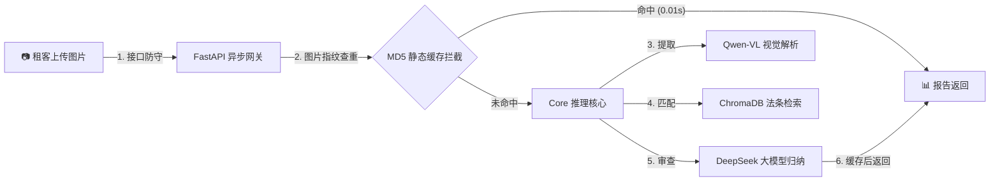

# 🏡 合规文档智能审查助手 - 项目白皮书 (MVP 修正版) 🏡

> 数据契约对齐：`docs/MiniRaguard AI_技术文档_v1.6.md`

---

## 💡 一、 它是干什么的？（原理大白话）

普通人看不懂合规文档里的法律套路，我们的系统充当一个**“全天候智能法律顾问”**。为了确保结论绝对权威，我们将过程拆解为三步：

1. **📷 第一步：看图识字 (Qwen 视觉大模型提取)**
   - **干啥**：把拍的照片交付给 **通义千问视觉大模型 API**，让其识别图片，翻译成电脑可以复制的“纯文字”。
   - **修正点**：我们是通过**云端 API** 调用，并非在本地昂贵的 GPU 上部署 7B 模型。

2. **⚖️ 第二步：翻书找法条 (RAG 检索增强)**
   - **干啥**：系统在后台翻阅中国《民法典》、《业务管理条例》词典，专门挑出和“押金、转租”等关键词相关的标准法律条文，防止大模型发生“幻觉”乱说。
   - **修正点**：向量数据库使用的是轻量、本地持久化的 **ChromaDB**，而不是 TiDB/pgvector 等分布式重型数据库。我们采用高效的**结构化正则分块**，而不是 AST 语法树。

3. **🧠 第三步：军师拆招 (DeepSeek 推理大模型审查)**
   - **干啥**：将原文和检索到的法条交付给 **DeepSeek-V3 API**，进行逐句对照和风险评级，输出 JSON。
   - **修正点**：主要调用的是低成本、高性价的 DeepSeek 全网通用版本，并非内置长时间思维链等待的 R1 模型。字段返回必须与 API 接口严格对应（如修改建议字段是 **`advice`**，而非 `modification_suggestion`）。

---

## 🏗️ 二、 极简架构图 (系统是怎么流转的？)

> **文档错误指正**：原档描述了分布式的 Celery 任务队列 + Redis + 显卡机群。我们在 MVP 阶段使用的是**轻量级、高并发单体架构（FastAPI 异步线程管理）**，调用云端大模型，极度节省服务器开销。

---

## 📌 三、 当前项目进度 (我们的底盤有多稳？)

### 1. ✅ 速度极快：基于 MD5 的图片指纹拦截
- **文档错误指正**：原档提及了复杂的 `pHash`（感知哈希）。我们的系统实际在入口直接采用 **`MD5 签名`** 拦截完全相同的图片流。结合本地底层的 **SQLite** 缓存数据表，查重极快。

### 2. ✅ 防护拉满：180s 总耗时熔断防护 (Wait-for)
- **原理**：接口内置了一层 180 秒的安全熔断机制。如因外部云端 API 拥塞，触发超时后将秒级返回 `HTTP 408` 告知分析超时，防止链路无尽锁死卡屏。

---

## 🤝 四、 需要你们（产品/设计/运营）提供的内容

底座完全通过云服务 API 打通，现需要以下交付物配合前言：

### 🎨 1. 界面原型图 / UI 设计图
- **三色卡片设计**：高风险（红色）、中风险（黄色）、低风险（绿色）。
- **字段绑定指正**：前端从后台拿到的是 `advice` (修改建议)，设计稿定版时请以此参数名绑定。

### 🛠️ 2. 产品交互规则确认
- **上传连通**：确认单次发起的 Base64 数组最高支承上限（建议控制在 10 张以内）。

### 📜 3. 运营与风险控制宣传文案
- 免责说明底部注脚。
- 中间的“转圈圈伪加载”炫酷文案，缓解云端模型可能产生的少许等待焦虑（云 API 单次完整跑一趟在 40-60s 左右，峰值有所变动）。
：法律助手属于辅助决策，需要在底部贴上“*本意见仅供参考，不构成正式法律文书*”的免责说明，需要文字稿。
- **冷启动动画/小贴士**：鉴于部分大模型计算需耗时几秒，中间可以加一些“*正在逐字复核民法典..*”的炫酷文字刷屏，需要提供创意。

---

> 🔧 **后端入口已全天候准备完毕。随时可以开展纯视觉化的前端联调！**
