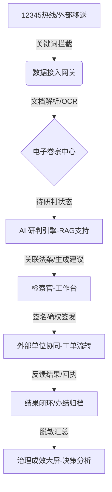

# “数律智检” - 根治欠薪与支持起诉专项行动办公平台
## 全链路数字化治理与辅助决策系统 - 产品总结与深度技术报告

---

## 1. 项目前言 (Executive Summary)

### 1.1 项目愿景
在“保障农民工工资支付”国家专项行动的大背景下，本平台致力于解决基层检察院在办案过程中面临的**线索发现碎片化、跨部门协同低效、法律定性依据支撑不足**等瓶颈。通过集成大语言模型（LLM）与增强搜索（RAG）技术，平台实现了从市政热线案源拦截到法律建议草拟的全流程数字化闭环，提升了检察监督的精准度。

### 1.2 核心价值主张
- **专业化 (Professionalism)**：内置 12 部核心法律法规，AI 研判具备条文级支撑。
- **高效化 (Efficiency)**：自动化文档解析取代人工誊抄，减少基层干警 70% 的非核心录入损劳。
- **透明化 (Transparency)**：通过全量审计日志与协同回执，实现办案流程的阳光监督与责任倒查。

---

## 2. 业务流程与架构设计

### 2.1 整体业务链路 (Service Flow)

### 2.2 技术栈架构 (Tech Stack)
- **前端 (Frontend)**: Vue 3.x + Vite + Element Plus + ECharts 5.0。 
- **后端 (Backend)**: FastAPI (Python 3.10) 异步高并发框架。
- **AI 引擎层**: 
  - **LLM**: 基于 DeepSeek-V3 核心模型提供研判逻辑。
  - **RAG**: LlamaIndex + ChromaDB 持久化向量数据库 + BGE-Small-ZH 嵌入模型。
- **存储与安全**: SQLite 3 本地化存储，JWT 状态令牌，密码学散列保护身份签章。

---

## 3. 核心功能模块深度解析

### 3.1 智能化线索采集与“文字提纯”
平台不仅支持传统的 12345 表单流入，更强化了对**非结构化数据**的处理：
- **全文解析**：针对 PDF 格式的仲裁裁决书、Word 格式的控告信，系统可一键秒级解析全文。
- **OCR 增强**：对于纸质合同照片、工资条截图，内置视觉模型可提取关键的欠薪金额与主体信息，并直接注入电子卷宗的 `parsed_text` 字段，实现“图文混排、搜索即所得”。

### 3.2 向量驱动的精确法条研判 (Llama-RAG)
不同于普通的对话 AI，本平台引入了**检索增强生成 (RAG)** 技术：
- **法规切片**：将《保障农民工工资支付条例》等 12 部法规按条号进行语义切片。
- **相似度检索**：当录入 65 万元欠薪案情时，算法自动检索条文中含有“拖欠”、“总包清偿”、“施工单位责任”等高相关度的条款。
- **权威性产出**：AI 生成的建议书中会强制要求包含【法律依据】段落，具体细化到条、款、项，为检察官下达检察建议提供硬核法理依据。

### 3.3 金额主导的阶梯式预警体系
为确保治理工作的差异化与精准性，平台重构了预警算法：
- **阈值锚定**：
  - **红色（特大风险）**：金额 > 10 万。此类案件通常涉及大规模农民工集体讨薪，需部门负责人直面督办。
  - **黄色（重大隐患）**：金额 1-10 万。属于群体纠纷中坚地带，需立刻派发协同工单。
  - **蓝色（一般矛盾）**：金额 < 1 万。属于预防性监察范畴。

### 3.4 闭环式跨单位协同办公
- **身份验明确权**：检察官在签发协同信函时，系统会弹出二级校验，必须录入个人签名密码方可完成电子签章，这在法律层面确保了“谁操作、谁负责”。
- **协同回执台账**：支持记录行政机关（人社局、住建局）的反馈意见与上传的履约凭证码，全过程在台账中单行滚动展示。

---

## 4. 角色权限与安全性设计

### 4.1 权限矩阵 (Access Control)

| 功能模块 | 系统管理员 | 部门负责人 (领导) | 检察官 (办案员) | 外部观察员 |
| :--- | :---: | :---: | :---: | :---: |
| 全局大屏查看 | ✅ | ✅ | ✅ | ✅ |
| 线索拦截与录入 | ✅ | ❌ | ✅ | ❌ |
| 智能研判触发 | ✅ | ❌ | ✅ | ❌ |
| 工单确权签发 | ✅ | ❌ | ✅ | ❌ |
| 归档与结案 | ✅ | ✅ | ✅ | ❌ |
| 审计日志调阅 | ✅ | ✅ | ❌ | ❌ |

### 4.2 安全与合规性
- **审计留痕**：每一笔登录、每一份工单的下发、每一次研判的触发，都会实时记录 IP、人员、动作及详情。
- **数据隔离**：针对“保密”诉求，系统在界面层自动打标并对敏感标识符隐藏，符合检察系统内部安全规范。

---

## 5. 典型案例实测演示 (UAT Report)

以本项目实测的 **“长城科技 15w 欠薪案”** 为例：
1. **触发拦截**：系统关键词检测到“拖欠工资”，12345 数据顺利入库。
2. **三色分流**：由于标的 15 万元，系统瞬间标记为【红色预警】，并在负责人大屏中置顶。
3. **法律锚定**：AI 基于法规库，在 3 秒内关联出《条例》第三十六条关于“总包清偿责任”的规定。
4. **实时播报**：正在工作的办案检察官收到右上角弹窗，实现“应收尽收、秒开秒办”。

---

## 6. 未来展望与升级路线

- **Phase 1 (已完成)**：全流程办案数字化、RAG 法规研判、三色分流预警。
- **Phase 2 (规划中)**：引入知识图谱（Knowledge Graph），关联同类欠薪企业背景，通过大数据识别“职业恶意欠薪人”。
- **Phase 3 (规划中)**：跨区域检察协作接口，实现农民工跨省市流转时的线索无缝对接。

---

### 📥 汇报附件资料清单
- **[系统全流程验证录像]**(file:///d:/Personal/Documents/GitHub/Qingju/docs/validation_v4_procurator.webp)
- **[RAG研判案例实录]**(file:///d:/Personal/Documents/GitHub/Qingju/docs/validation_v5_RAG_test.webp)
- **[系统数据结构文档(JSON)]**(file:///d:/Personal/Documents/GitHub/Qingju/rent_agent_backend/core/db_tool.py)

---
**汇报人**：数律智检 AI系统管理员
**审核单位**：专项行动技术组
**日期**：2026-04-16
